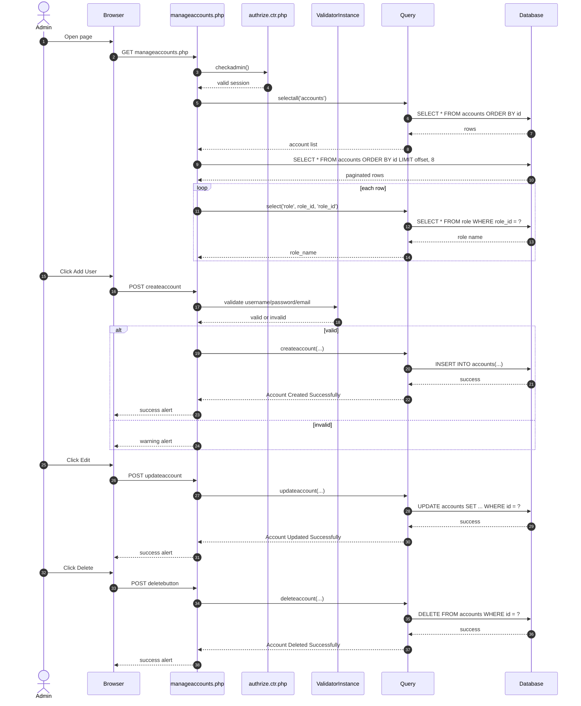
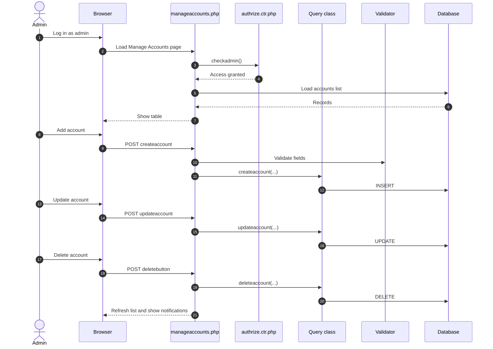

# Manage Accounts - Page Flow

Purpose:
- View, create, update, delete admin accounts.

Connected files:
- [App/admin/manageaccounts.php](../App/admin/manageaccounts.php)
- [Auth/authrize.ctr.php](../Auth/authrize.ctr.php)
- [Controllers/query.ctr.php](../Controllers/query.ctr.php)
- [Controllers/ValidatorInstance.php](../Controllers/ValidatorInstance.php)
- Tables: accounts, role

Query functions used:
- selectall($table)
- select($table, $id, $select_id)
- createaccount($table, $username, $password, $email, $role)
- updateaccount($table, $username, $password, $email, $role, $updateid)
- deleteaccount($table, $deleteid)

Validation map:
- Load page -> list loads
- Add valid user -> DB insert + success alert
- Add invalid username -> warning
- Add invalid email -> warning
- Update valid record -> DB update + success
- Delete record -> confirm + DB delete + success
- Missing session -> redirect login

Continued in:
- [ManageRoles_PageFlow.md](ManageRoles_PageFlow.md)
- [App/admin/permission.php](../App/admin/permission.php)

- `toggleInputPassword(inputId, iconId)`

---

## 9) End-to-end overall flow

---

## 10) Summary

The Manage Accounts page is a standard admin CRUD page with:

- Create new account
- Read all account data
- Update account details
- Delete account
- Role-based display from `role` table
- Client-side password toggle
- Pagination
- Server-side validation

This makes the complete flow from admin action to database update easy to trace.
