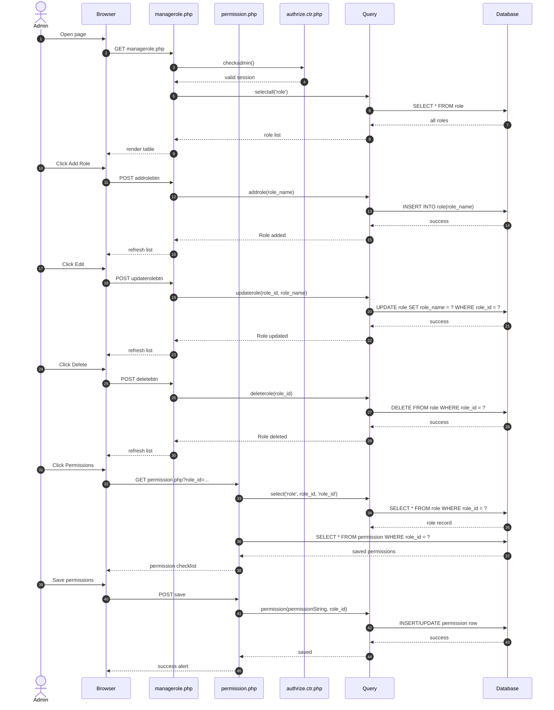

# Manage Roles - Page Flow

Purpose:
- View, add, edit, delete roles.
- Open permissions page for each role.

Connected files:
- [App/admin/managerole.php](../App/admin/managerole.php)
- [App/admin/permission.php](../App/admin/permission.php)
- [Auth/authrize.ctr.php](../Auth/authrize.ctr.php)
- [Controllers/query.ctr.php](../Controllers/query.ctr.php)
- Tables: role, permission

Query functions used:
- selectall($table)
- select($table, $id, $select_id)
- addrole($role_name)
- updaterole($role_id, $role_name)
- deleterole($delete_role_id)
- permission($permission, $role_id)

Validation map:
- Load page -> table loads
- Add role -> DB insert + refresh
- Edit role -> DB update + refresh
- Delete role -> DB delete + refresh
- Invalid empty role name -> validation/error path
- Open permissions -> gets role + permission data
- Save permissions -> saves role access list
- Missing session -> redirect login

Continued in:
- [ManageAccounts_PageFlow.md](ManageAccounts_PageFlow.md)
- other admin pages use permission values to restrict access