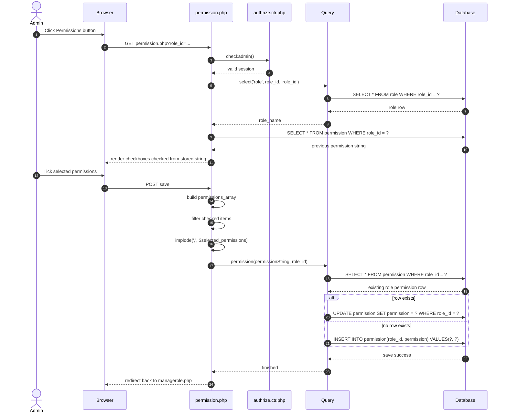

# Permission - Page Flow

Purpose:
- Assign access rights to a selected role.
- Save a comma-separated permission string for that role.

Connected files:
- [App/admin/permission.php](../App/admin/permission.php)
- [App/admin/managerole.php](../App/admin/managerole.php)
- [Auth/authrize.ctr.php](../Auth/authrize.ctr.php)
- [Controllers/query.ctr.php](../Controllers/query.ctr.php)
- Tables: role, permission

Query functions used:
- select($table, $id, $select_id)
- permission($permission, $role_id)

Validation map:
- Open permission page -> role name and saved permissions load
- Save with valid permissions -> update/insert row + redirect
- Save with no permissions -> empty string saved
- Missing role_id -> page cannot load proper role
- Missing session -> redirect login
- Re-open page -> all checked permissions appear again

Continued in:
- [ManageRoles_PageFlow.md](ManageRoles_PageFlow.md)
- other admin pages read permission values to decide access
