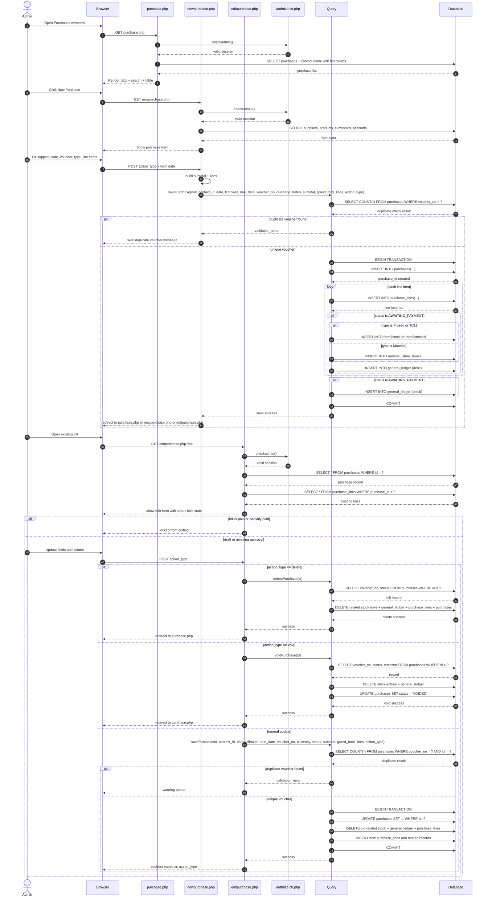

# Purchase - Page Flow

Purpose:
- Create new purchase bills
- View purchase list and filter by status
- Edit draft or awaiting-approval bills
- Approve bills into payment stage
- Delete drafts or void approved bills
- Post stock and ledger entries when approved

Connected files:
- [App/admin/purchase.php](../App/admin/purchase.php)
- [App/admin/newpurchase.php](../App/admin/newpurchase.php)
- [App/admin/editpurchase.php](../App/admin/editpurchase.php)
- [Auth/authrize.ctr.php](../Auth/authrize.ctr.php)
- [Controllers/query.ctr.php](../Controllers/query.ctr.php)
- Tables: purchases, purchase_lines, contacts, products, general_ledger, form7stock, form7stocktcl, material_store_house

Query functions used:
- savePurchase($id, $contact_id, $date, $tclfrozen, $due_date, $voucher_no, $currency, $status, $subtotal, $grand_total, $lines, $action_type)
- deletePurchase($id)
- voidPurchase($id)
- payPurchaseBill($purchase_id, $payment_date, $payment_account, $reference)

Validation map:
- Overview page -> tabs and search filter work
- New purchase -> supplier/date/voucher required
- Duplicate voucher -> validation error
- Missing account code on approved item -> validation error
- Save draft -> record stays draft
- Submit for approval -> status becomes AWAITING_APPROVAL
- Approve -> status becomes AWAITING_PAYMENT and stock/ledger entries are created
- Edit paid or partially paid bill -> audit block
- Delete draft -> allowed
- Delete approved/paid bill -> strict audit block
- Void approved bill -> reverse stock + ledger + status voided
- Re-open bill -> correct status and lock state

Continuation:
- [SequenceDiagram/Permission_PageFlow.md](Permission_PageFlow.md) controls which role can access purchase functions
- Purchase approval and payment details continue into payable/ledger-related flows in other pages
- Payment processing logic connects to [Controllers/query.ctr.php](../Controllers/query.ctr.php) through payPurchaseBill() and related ledger updates
