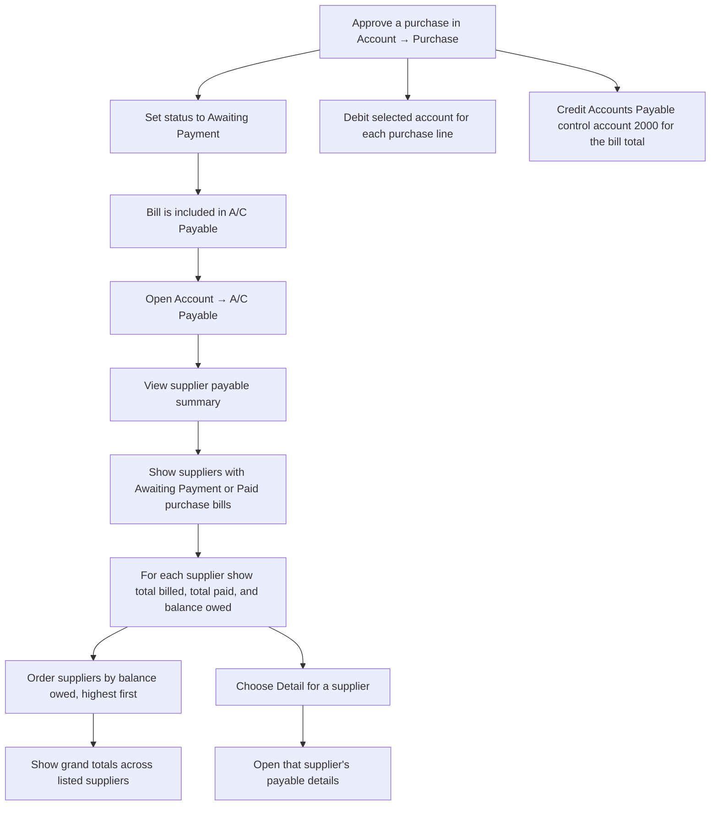
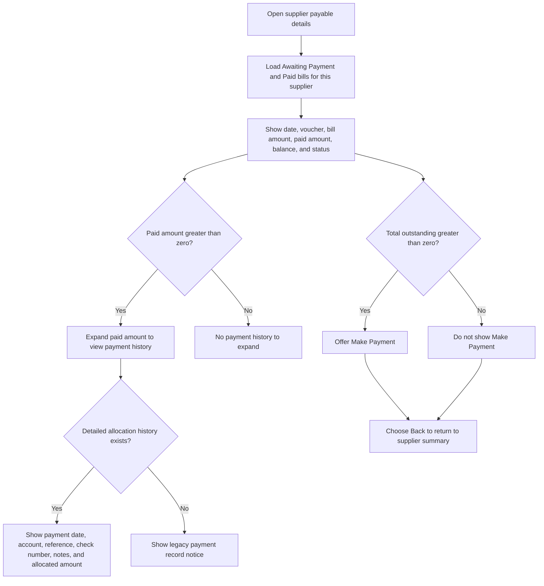
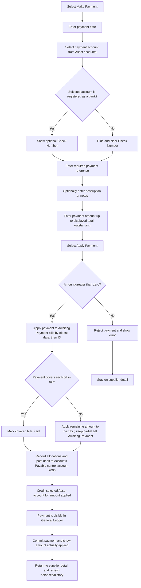

# A/C Payable User Flow Diagram

**Access:** The Account sidebar shows A/C Payable to roles with the `manage_acpayable` permission.

> This diagram covers **A/C Payable** (`acpayable.php` and supplier detail/payment). The separate **Account Payable** menu item is a different, legacy workflow.

## 1. Review supplier balances

## 2. Review bills and payment history

## 3. Apply a supplier payment

## Rules and details

- The summary is calculated from supplier contacts and purchase bills with status **Awaiting Payment** or **Paid**. It excludes Draft, Awaiting Approval, and Voided bills.
- An approved purchase from **Account → Purchase** creates the bill that appears here: the purchase posts debits to its selected line accounts and a credit to Accounts Payable control account `2000`. Draft and Awaiting Approval purchases have not yet created these approval postings and are excluded from this summary. See the [Purchase workflow](./purchaseUserFlowDiagram.md).
- Packing Material purchases are entered through **Account → Purchase** with type **Material**. Once approved, they become **Awaiting Payment** bills and appear here like other approved purchases. The separate Packing Material Purchase screen is not part of this workflow; see the [Packing Material W/H workflow](../Packing%20Material/packingMaterialWarehouseUserFlowDiagram.md).
- **Balance owed** is the sum of each included bill's `grand_total - paid_amount`. The bottom row totals billed, paid, and owed across the displayed supplier rows.
- Supplier detail lists bills in oldest-first order and labels them **Unpaid**, **Partial**, or **Paid**. A paid amount can be expanded to show its allocation history. Older records without detailed payment allocations show a legacy notice instead.
- **Make Payment** appears only when the supplier's total outstanding balance is greater than zero. Required fields are payment date, payment account, reference, and a positive amount. Description/notes and check number are optional.
- The account dropdown uses Asset-class accounts. Check Number appears only when the selected account is registered as a bank; switching to a non-bank account hides and clears it.
- One payment is allocated automatically across the supplier's **Awaiting Payment** bills, oldest date and then lowest ID first. Bills fully covered become **Paid**; a bill that receives only part of the remaining payment stays **Awaiting Payment**.
- Each allocation records date, account, reference, optional check number/description, and amount. The payment also posts a debit to Accounts Payable control account `2000` and a credit to the selected Asset account in the General Ledger. Supplier bill approval and supplier cash payment are separate ledger events.
- The server validates the payment amount against total outstanding and reports the amount actually applied.
- Use **Back** to return to the supplier balance summary. The detail page does not provide controls to edit or delete individual payment allocations.
