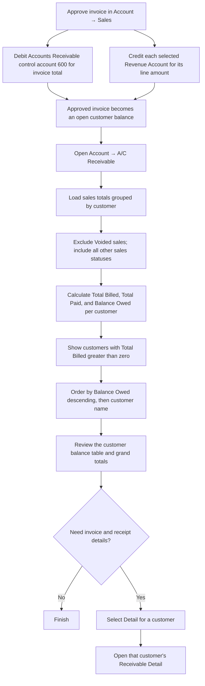
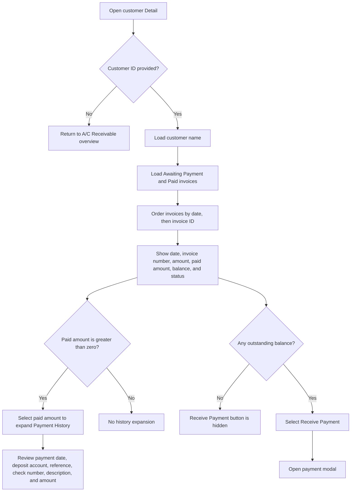
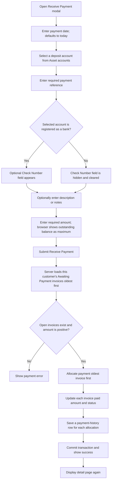

# A/C Receivable — User Flow

This diagram documents how staff review customer balances and record customer receipts.

## 1. Review receivable balances

## 2. Review invoices and payment history

## 3. Receive and allocate a customer payment

## Rules and details

- The overview groups sales by customer and shows **Total Billed**, **Total Paid**, **Balance Owed**, and a **Detail** action. It also displays grand totals at the bottom.
- Voided, Draft, and Awaiting Approval sales are excluded from the overview calculation. The overview only displays customers whose calculated Total Billed is greater than zero.
- Customer Detail lists only **Awaiting Payment** and **Paid** invoices. Draft, Awaiting Approval, and Voided invoices are not listed. Invoices are ordered oldest date first, then by ID.
- The receivable begins when a sale is approved: Sales posts a debit to Accounts Receivable control account `600` and credits the selected Revenue Account(s). This is the invoice-side General Ledger posting; sale approval does not record customer cash received.
- Invoice payment status is displayed as **Paid** when no balance remains, **Partial** when some amount has been paid, and **Unpaid** otherwise.
- The payment dialog is offered only if the listed invoices have a positive total outstanding balance. The deposit account list is drawn from Chart of Accounts asset accounts; registered bank accounts additionally show the optional Check Number field.
- Receipts are allocated FIFO across open invoices. A fully covered invoice becomes **Paid**; an invoice with a remaining balance stays **Awaiting Payment**. Each invoice allocation is saved in `sale_payments` and can be reviewed by expanding its paid amount.
- The server validates the amount against outstanding invoices and reports the actual amount allocated. Each receipt also posts a debit to the selected deposit account and a credit to Accounts Receivable control account `600` in the General Ledger.
