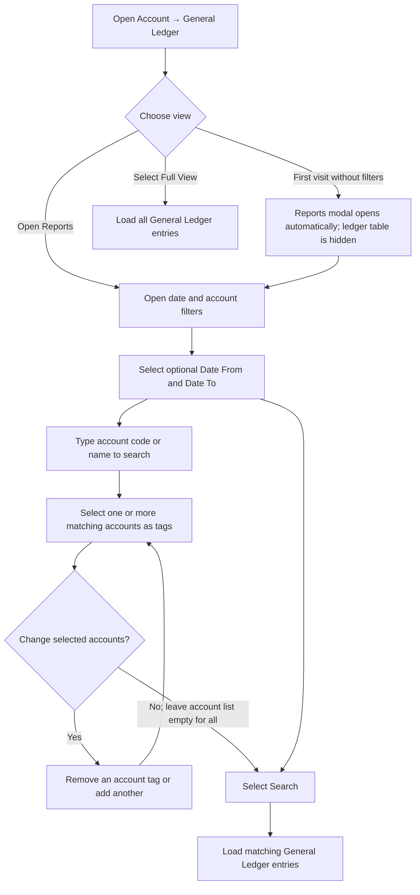
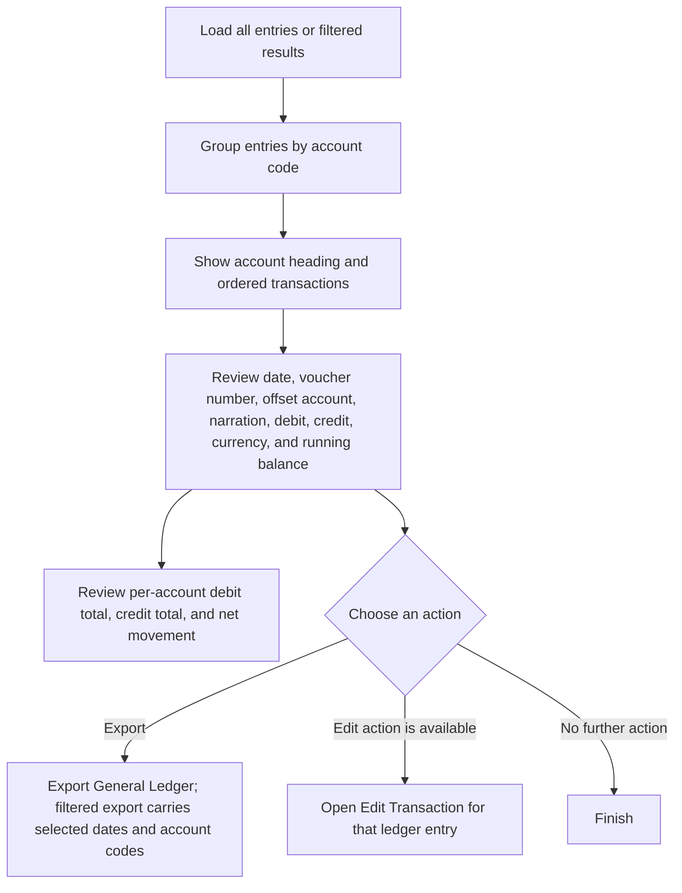
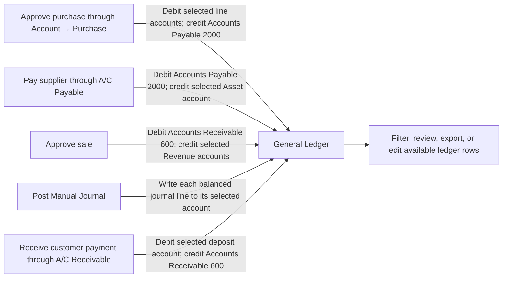

# General Ledger — User Flow

This diagram covers the **Account → General Ledger** page and its ledger report controls.

## 1. Open the ledger

## 2. Read, export, or edit ledger entries

## 3. Where Account General Ledger entries come from

## Rules and details

- On a fresh visit, the Reports modal opens automatically and the table stays hidden until a report is run. **Full View** loads the ledger without date or account filters. The **Reports** button opens the filters again.
- **Date From** and **Date To** are optional. When both are supplied, the search includes entries between and including those dates. The account selector searches both account codes and names; selected accounts appear as removable tags. Leaving the account selection empty searches all accounts.
- Results are grouped by account, with transactions ordered by account code, date, then ledger row ID. Each transaction shows date, voucher number, offset account, narration, debit, credit, currency, and a running debit-minus-credit balance. Each account section also shows total debit, total credit, and net movement for the displayed result set.
- This page is the shared view of accounting postings made by other Account workflows; it is not the source screen for entering purchase bills, sales invoices, supplier payments, or manual journals. Approved purchases and sales create invoice-side postings; A/C Payable supplier payments and A/C Receivable customer receipts create cash-settlement postings; posted Manual Journals write their entered lines. See the [Purchase](./purchaseUserFlowDiagram.md), [A/C Payable](./acPayableUserFlowDiagram.md), [Sales](./salesUserFlowDiagram.md), [A/C Receivable](./acReceivableUserFlowDiagram.md), and [Manual Journals](./manualJournalUserFlowDiagram.md) workflows.
- In this application’s current posting paths: purchase approval through **Account → Purchase** debits each selected purchase line account and credits Accounts Payable control account `2000`; supplier payment debits `2000` and credits the selected Asset account; sale approval debits Accounts Receivable control account `600` and credits each selected Revenue account; customer receipt debits the selected deposit account and credits Accounts Receivable `600`. Manual Journals write each line’s selected account and debit/credit amount. Packing Material purchases use the Material type in **Account → Purchase**, so they follow the same payable and ledger posting path while also adding Warehouse stock.
- Currency is inferred from the account code: the page labels accounts containing `1502` or `3600/002` as USD and other accounts as MMK.
- The per-entry edit control is hidden when the displayed offset account name contains “purchase”; otherwise it opens the transaction editor. Export is available for all ledger entries or the current filtered date/account selection.
- When only Date From is supplied, the ledger includes entries on or after that date; when only Date To is supplied, it includes entries on or before that date. The running balance starts at zero within the displayed filtered rows rather than including a prior-period opening balance.
