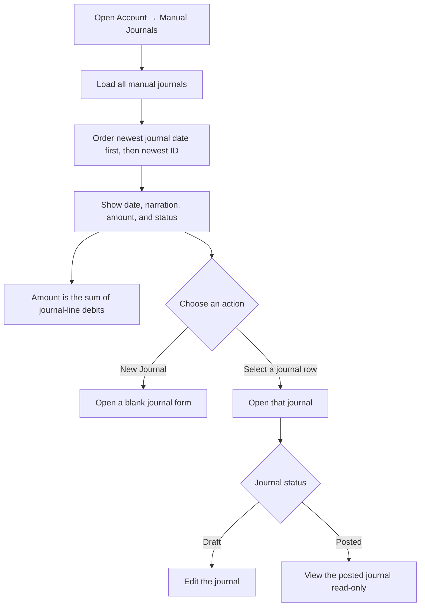
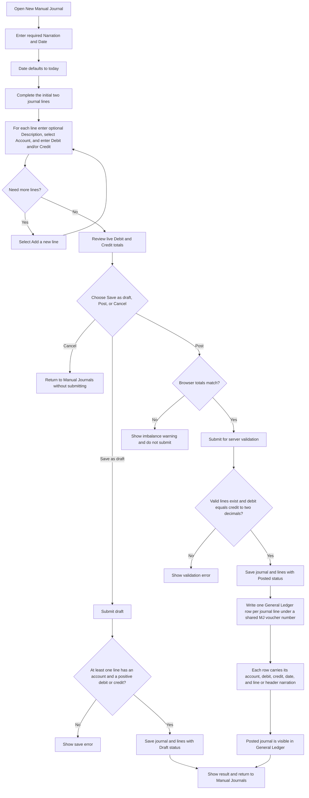
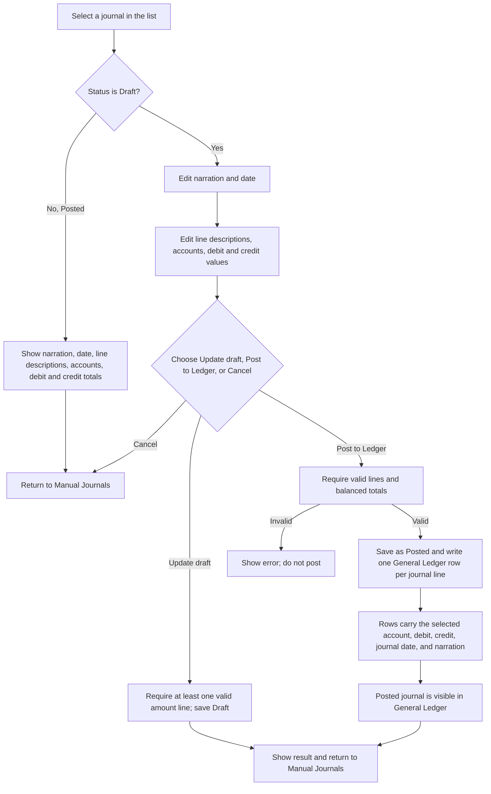

# Manual Journals — User Flow

Manual journals are accounting adjustments. The New Manual Journal page recommends that only an accountant or bookkeeper create them.

## 1. Review the journal list

## 2. Create a journal

## 3. Edit or view an existing journal

## Rules and details

- The journal list includes Draft and Posted entries, ordered by journal date descending and ID descending. Selecting a row opens its detail page. There are no visible delete or void actions.
- Narration and date are required; the date defaults to today. Each line has an optional description, a required account selected from accounts grouped by account type, and debit and credit amounts. A new journal starts with two rows; **Add a new line** appends rows.
- The New Journal form has no remove control on its initial two rows; lines added with **Add a new line** can be removed. The edit form provides a remove control for each existing line.
- Totals update as amounts are entered. The interface indicates balanced totals in green and an imbalance in red. Browser-side posting validation requires equal, non-zero totals; the server also validates that the posted journal balances to two decimal places.
- Drafts may be saved unbalanced, but a journal must contain at least one account line with a positive amount. Drafts have no General Ledger effect. Posting changes status to Posted and creates one General Ledger row per line under a shared `MJ-...` voucher number. Each row uses the line description as narration or the journal narration when the line description is blank.
- Draft detail can be updated as Draft or posted to the ledger. Posted journals are shown read-only in the normal page flow.
- The update endpoint also enforces Posted journals as read-only; a direct update request cannot change a posted journal or create duplicate ledger lines.
