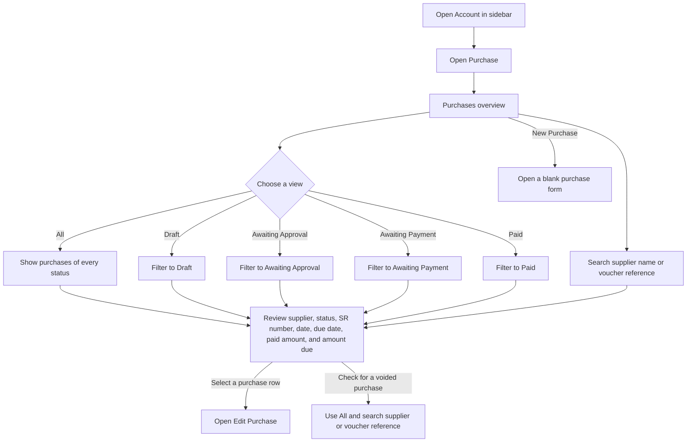
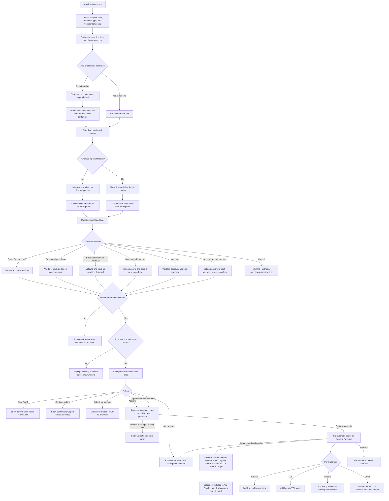
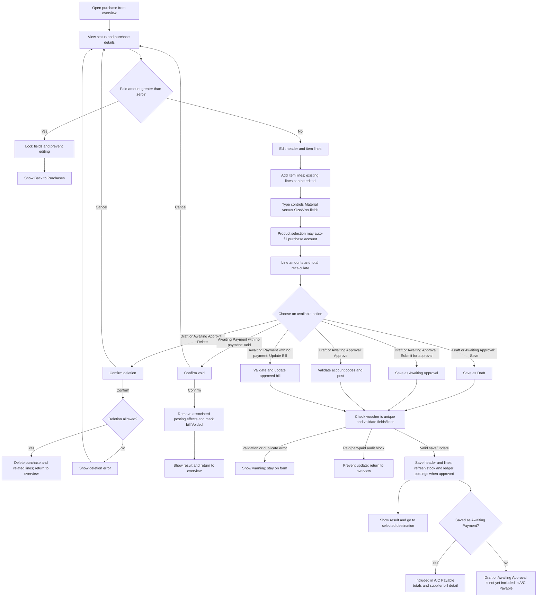

# Purchase User Flow Diagram

**Access:** The Account sidebar shows Purchase to roles with the `manage_purchase` permission.

## 1. Find and open a purchase

## 2. Create a purchase

## 3. Edit, delete, or void a purchase

## Rules and details

- The overview has **All, Draft, Awaiting Approval, Awaiting Payment, and Paid** tabs. Select a row to open it. The displayed **Amount** is the outstanding amount (`grand total - paid amount`); Paid is shown separately.
- The overview has a **Voided** tab and distinct status styling for voided purchases.
- Purchase header fields: supplier, date, type (**Frozen**, **TCL**, **Material**, or **Other**), optional due date, voucher/reference number, and currency (MMK or an active currency). The voucher/reference must be unique.
- Add item rows with **Add a new line**. Each row can contain product, description, size, Viss, Pcs, unit price, and account. Product choices are limited to products marked as purchasable. Selecting a product can automatically fill its configured purchase account.
- There is no visible remove-row button. A row with no entered values is skipped when saving; the form does not offer an explicit row-removal action.
- For **Material**, Size and Viss are hidden and Pcs is the quantity. For Frozen, TCL, and Other, Size and Viss are shown and Viss is used for the line amount; Pcs is optional. The displayed line amount is quantity × unit price; subtotal and total update as values change.
- Before saving, the form requires supplier, date, and voucher reference, at least one product line, a positive unit price and account for each selected product, plus Size and positive Viss for non-Material types or positive Pcs for Material. Description, Pcs on non-Material lines, and due date are optional. Approval/posting additionally requires an account code for every saved line.
- Saving as Draft creates a **Draft**. Submitting for approval creates **Awaiting Approval**. Approving posts the purchase and sets it to **Awaiting Payment**. The save menu also has **Save (continue editing)** and **Save & add another**; the approval menu has **Approve & add another**.
- Only **Awaiting Payment** and **Paid** purchases appear in **A/C Payable**. Draft and Awaiting Approval purchases are excluded; approving a purchase makes it an outstanding supplier bill in A/C Payable. Supplier payments can then allocate against that bill and eventually change it to Paid.
- Approval posts a debit for each item line to its selected account and a credit for the bill total to payable control account `2000` in the General Ledger. The approved purchase type also determines its operational stock movement: Frozen and TCL post to their respective stock records; Material adds quantity to Packing Material W/H. These effects are refreshed when an approved unpaid purchase is updated and removed when it is voided.
- On an existing bill, Draft and Awaiting Approval records can be deleted. Awaiting Payment records with no payment can be voided. Any paid or partially paid purchase is locked against editing; approved purchases with no payment can be updated.
- A void action is available only for an unpaid Awaiting Payment purchase. It removes the related general-ledger entries and the applicable frozen/TCL stock or material-store movement, then marks the purchase **VOIDED**. A paid/part-paid purchase cannot be voided through this action.
- Edit Purchase, like New Purchase, limits the supplier picker to suppliers.
