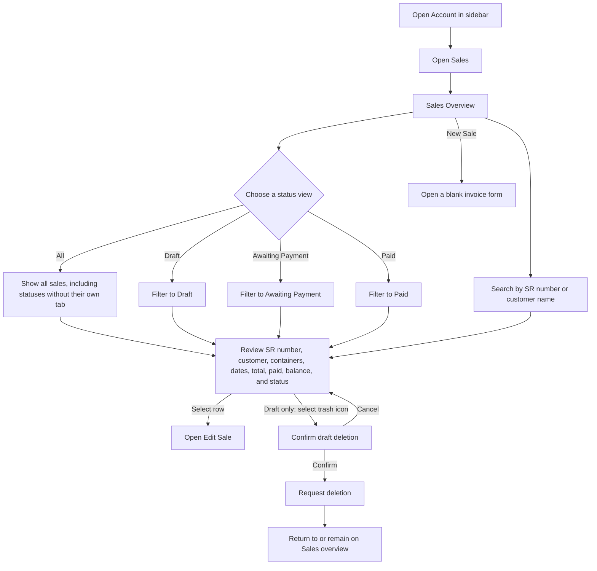
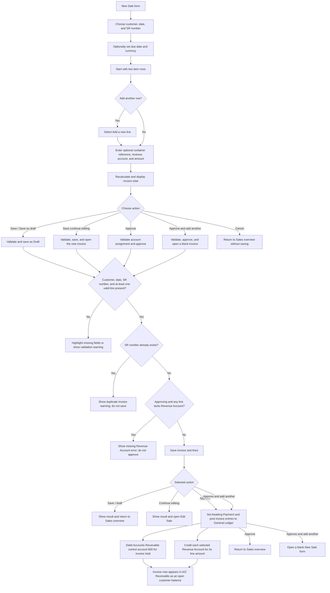
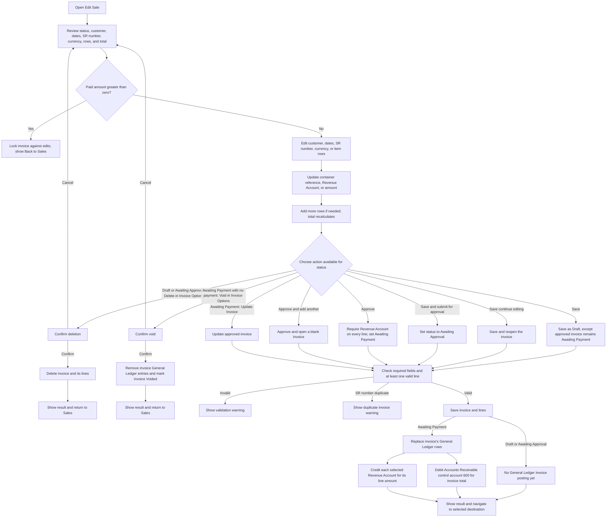
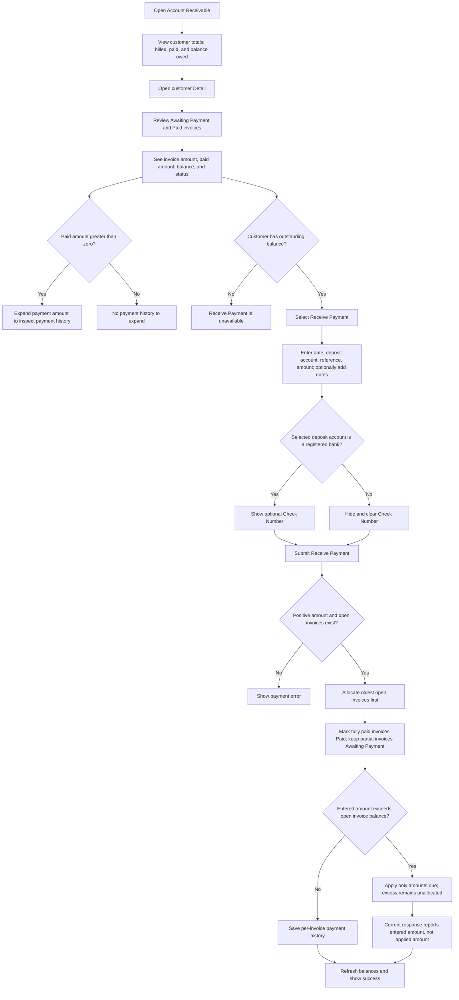

# Sales User Flow Diagram

**Access:** The Account sidebar shows Sales to roles with the `manage_sale` permission.

## 1. Find and open a sale

## 2. Create a sale

## 3. Edit, submit, approve, delete, or void

## 4. Receive payment (via A/C Receivable)

## Rules and details

- Sales Overview has **All, Draft, Awaiting Approval, Awaiting Payment, Paid, and Voided** tabs with distinct status styles. Search matches the **SR number** or **customer name**. Selecting a row opens Edit Sale.
- Each row shows SR number, customer, distinct container references, date, optional due date, total and currency, paid amount, balance due, status, and an action. The overview trash icon is shown only for Draft invoices.
- Voided invoices are read-only and cannot be edited or approved. Draft sale deletion is submitted via POST and its result is shown.
- A new sale starts with two rows; **Add a new line** appends rows. There is no visible row-removal control. Empty rows are ignored when saving.
- Each line has an optional **Container Reference**, a **Revenue Account**, and an **Amount**. The page recalculates the total from line amounts. At least one line with a Revenue Account and positive amount is required; approval also requires an account on every saved line.
- Required invoice fields are customer, date, and SR number; the SR number must be unique. Due date is optional. Customer choices are contacts marked as customers. Currency is USD by default on the new form, with configured active currencies also available.
- New Sale offers **Save / Save as draft**, **Save (continue editing)**, **Approve**, **Approve & add another**, and **Cancel**. It does not show a Submit for Approval action. Edit Sale additionally offers **Save & submit for approval** for Draft/Awaiting Approval invoices.
- Editing a Draft or Awaiting Approval invoice can save it, submit it for approval, or approve it. An approved, unpaid invoice can be updated. Any invoice with a positive paid amount is locked.
- Draft and Awaiting Approval invoices can be deleted in Edit Sale. The overview exposes deletion only for Drafts. An Awaiting Payment invoice can be voided from Edit Sale only while it has no payment; voiding removes matching General Ledger entries and changes status to Voided.
- When approved, an invoice posts a debit to Accounts Receivable control account `600` for the invoice total and credits each selected Revenue Account for that line's amount. The invoice then appears in **A/C Receivable** as an outstanding customer balance. Draft and Awaiting Approval invoices do not post these invoice entries.
- Customer receipts are not entered in Sales; use **Account → A/C Receivable → customer Detail → Receive Payment**. The payment is allocated oldest invoice first, and invoices transition to Paid when fully covered. The receipt form requires date, deposit account, reference, and amount; notes and check number are optional, with check number shown for registered banks.
- The server validates customer receipt amounts against total outstanding and reports the actual amount allocated. Receipts also post a debit to the selected deposit account and a credit to Accounts Receivable `600`.
- A/C Receivable summary totals exclude Draft and Awaiting Approval sales; customer detail shows only Awaiting Payment and Paid invoices.
