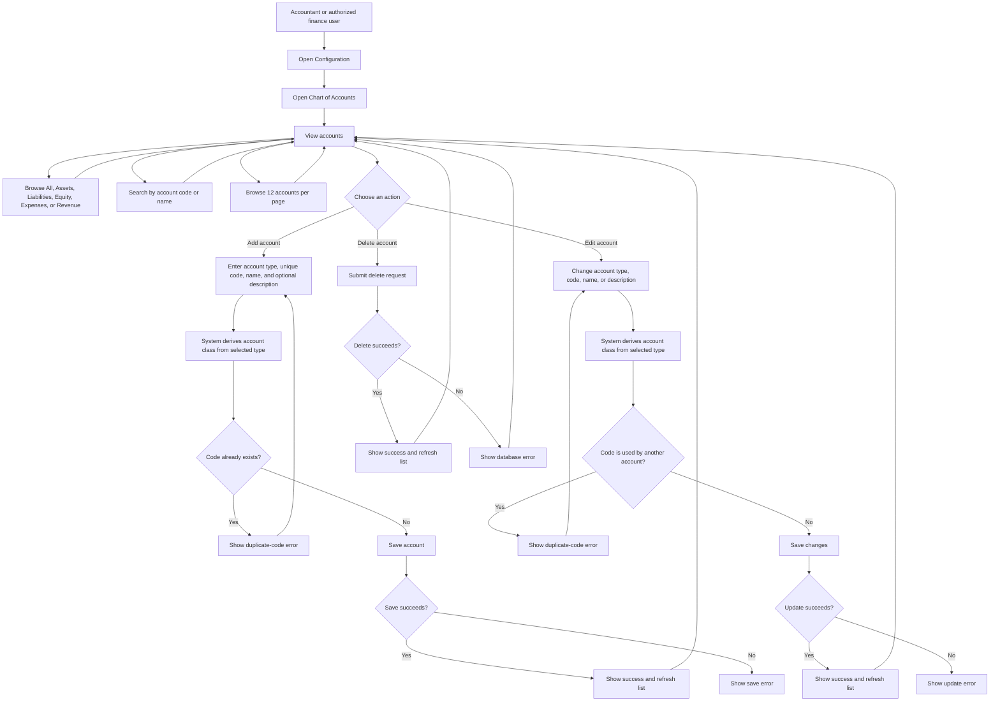

# Chart of Accounts User Flow Diagram

**Intended users:** Accountants or authorized finance staff. In the application, the Configuration menu displays this page for roles with the `manage_coa` permission.

## Quick guide

- Use the chart to define the accounts used to organize the organization's financial activity. Set it up with the accountant responsible for the books.
- Every account needs a **unique code**, a **name**, and a **type**. The description is optional.
- Choose the type that reflects the account's purpose. The available types are grouped under Assets, Equity, Expenses, Liabilities, and Revenue. The system assigns the corresponding class automatically.
- Search by code or name, or use the class tabs to narrow the list. The page shows 12 accounts at a time.
- Review account changes with the accountant: other financial workflows use the chart. Before deleting an account, check whether it is already used; the application may reject deletion when the database prevents it.
- `manage_coa` controls whether the Chart of Accounts link appears in Configuration for a role. Give it only to the intended accountant/finance role.
