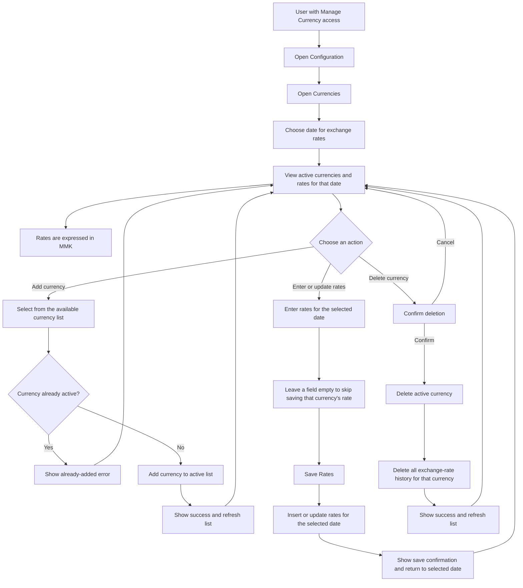

# Currencies User Flow Diagram

## Quick guide

- The page manages **active currencies** and their exchange rates against **MMK**. Select the date first; rates shown and saved are for that date.
- Add currencies only from the list provided by the application. A currency already active cannot be added again.
- Enter the applicable rate for each currency, then select **Save Rates**. Existing rates for that date are updated; missing rates for that date are inserted. Empty rate fields are skipped rather than saved.
- Deleting a currency removes it from the active list **and permanently deletes its exchange-rate history**. Confirm this is intended before deleting.
- The sidebar displays this page to roles with the `manage_currency` permission.
