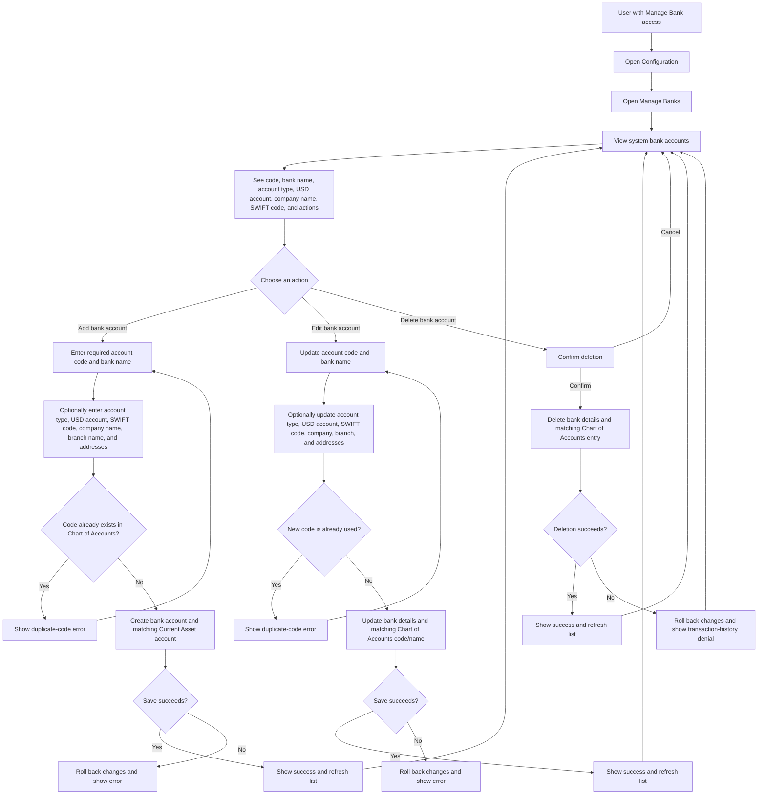

# Manage Banks User Flow Diagram

## Quick guide

- Manage Banks records the bank account details used by the system. **Account code** and **bank name** are required; the remaining details are optional.
- Adding a bank account also creates a matching **Current Asset** account in the Chart of Accounts. Its code must not already exist there.
- Editing keeps the bank details and matching Chart of Accounts account code/name synchronized. Choose a code that is not already used by another account.
- Deleting removes both the bank details and the matching Chart of Accounts entry. The application may block deletion when the account has transaction history.
- The Configuration sidebar shows Manage Banks to roles with the `manage_bank` permission.
