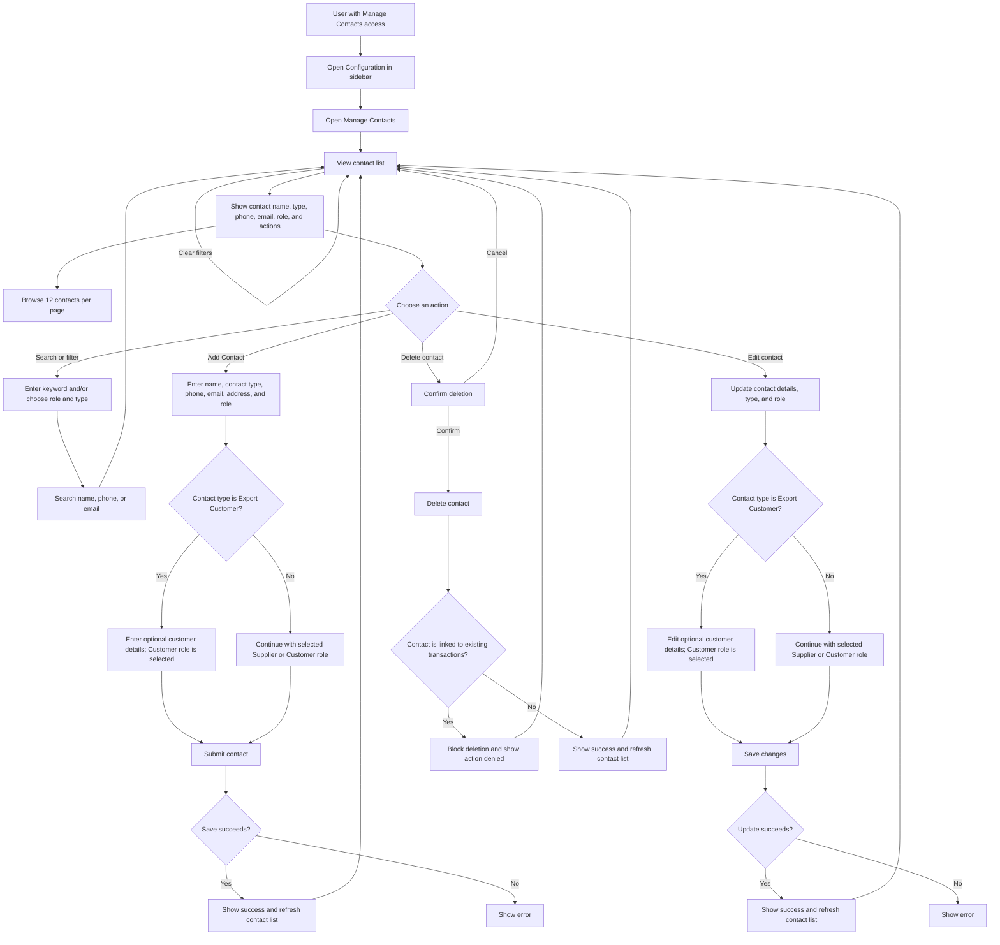

# Manage Contacts User Flow Diagram

```mermaid
flowchart TD
    A[User with Manage Contacts access] --> B[Open Configuration in sidebar]
    B --> C[Open Manage Contacts]
    C --> D[View contact list]
    D --> D1[Show contact name, type, phone, email, role, and actions]
    D1 --> D2[Browse 12 contacts per page]
    D1 --> E{Choose an action}

    E -->|Search or filter| F[Enter keyword and/or choose role and type]
    F --> F1[Search name, phone, or email]
    F1 --> D
    D -->|Clear filters| D

    E -->|Add Contact| G[Enter name, contact type, phone, email, address, and role]
    G --> G1{Contact type is Export Customer?}
    G1 -->|Yes| G2[Enter optional customer details; Customer role is selected]
    G1 -->|No| G3[Continue with selected Supplier or Customer role]
    G2 --> G4[Submit contact]
    G3 --> G4
    G4 --> G5{Save succeeds?}
    G5 -->|Yes| G6[Show success and refresh contact list]
    G5 -->|No| G7[Show error]
    G6 --> D

    E -->|Edit contact| H[Update contact details, type, and role]
    H --> H1{Contact type is Export Customer?}
    H1 -->|Yes| H2[Edit optional customer details; Customer role is selected]
    H1 -->|No| H3[Continue with selected Supplier or Customer role]
    H2 --> H4[Save changes]
    H3 --> H4
    H4 --> H5{Update succeeds?}
    H5 -->|Yes| H6[Show success and refresh contact list]
    H5 -->|No| H7[Show error]
    H6 --> D

    E -->|Delete contact| I[Confirm deletion]
    I -->|Cancel| D
    I -->|Confirm| J[Delete contact]
    J --> K{Contact is linked to existing transactions?}
    K -->|Yes| K1[Block deletion and show action denied]
    K -->|No| K2[Show success and refresh contact list]
    K1 --> D
    K2 --> D
```
