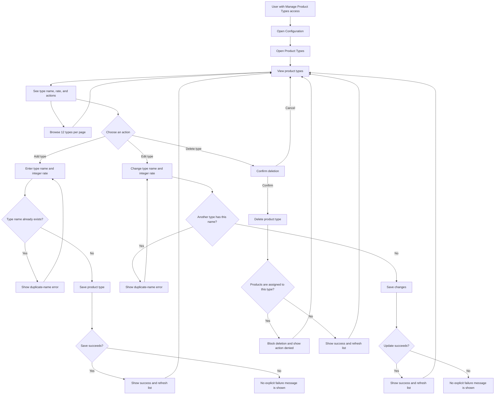

# Product Types User Flow Diagram

## Quick guide

- Product types are labels used to classify products. They are selected when adding or editing a product.
- Each type has a **name** and an integer **rate**. Names must be unique. The application does not explain the business meaning of the rate, so confirm how it is used before changing it.
- Use this page to add, edit, and browse types. It shows 12 types per page.
- A type cannot be deleted while products are assigned to it. Reassign those products first, if appropriate.
- The sidebar displays this page to roles with the `manage_product_types` permission.
