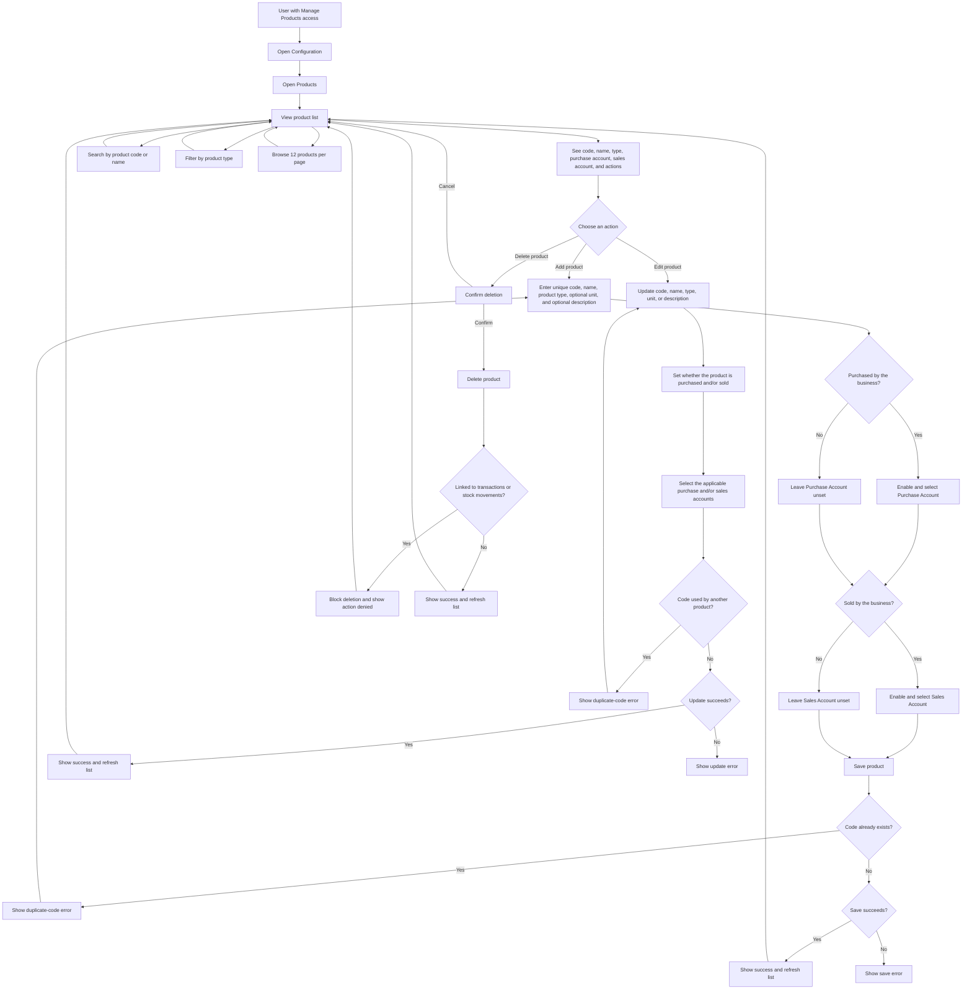

# Products User Flow Diagram

> Products configured here are used in purchase, sales, and stock workflows.

## Quick guide

- Create a product with a unique **code**, a **name**, and an existing **product type**. Unit and description are optional.
- Mark whether the business purchases the product, sells it, or both. When enabled, select the corresponding **Purchase Account** and/or **Sales Account** from the Chart of Accounts. Leave the checkbox off when that activity does not apply.
- The account lists come from the Chart of Accounts. Coordinate account choices with the accountant so purchases and sales are recorded consistently.
- Search by code or name, filter by product type, and use the page controls to browse the list.
- Edit a product to maintain its details and accounting links. Codes must remain unique.
- Deletion requires confirmation and may be denied when the product is already linked to transactions or stock movements.
- Product types are selected here but maintained separately under **Product Types**.
