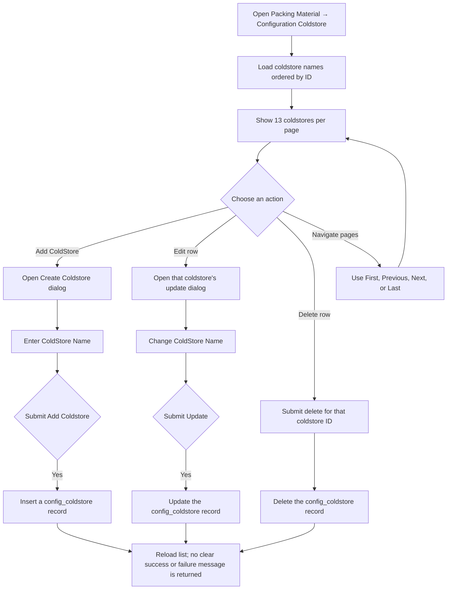

# Configuration Coldstore — User Flow

This configuration maintains the coldstore destinations available when issuing packing material from the warehouse.

## Manage coldstore destinations

## Rules and details

- The table displays a row number, **Coldstore Name**, and row actions to edit or delete. The **Add ColdStore** button opens a dialog to create a name.
- Both create and update dialogs have **Close** and submit buttons. Deletion is submitted immediately from the row; no confirmation step is shown.
- The list is ordered by record ID and paginated at 13 records per page, with **First**, **Previous**, **Next**, and **Last** controls.
- The coldstore names are used as the **Stock To** choices in the Packing Material W/H **Output** dialog. The warehouse output records the selected destination as transaction history; deleting a configuration name removes it from future choices but does not rewrite past destination records.
- The name fields are not marked required. The current create, update, and delete handlers do not return a result message, so the page has no reliable visible confirmation or error for those operations.
- **Follow-up issues:** require a non-empty coldstore name and provide visible success/error feedback for add, update, and delete. See the root [TODO.md](../../TODO.md).
