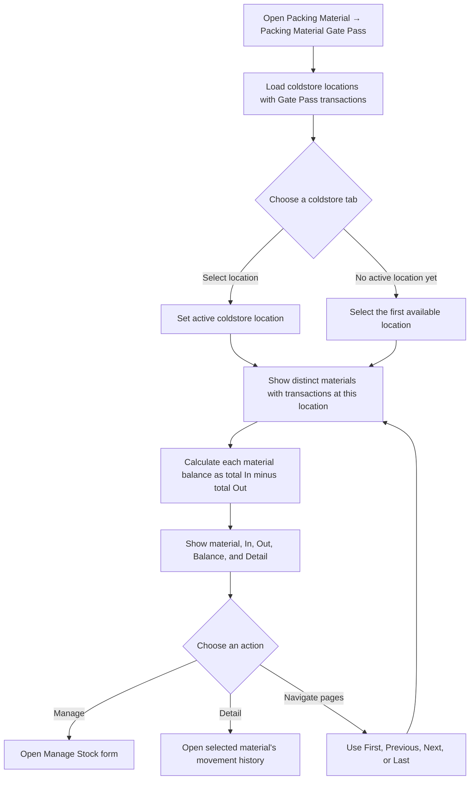
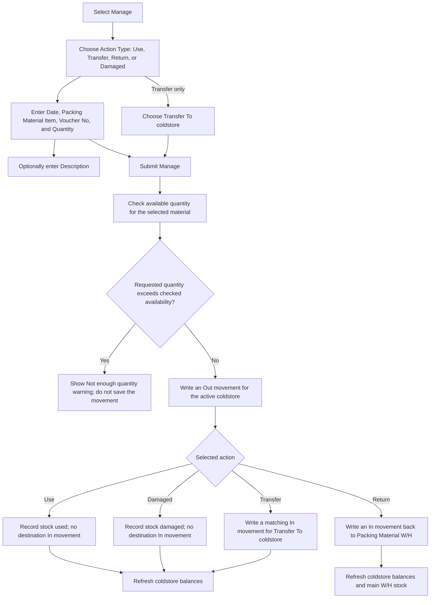
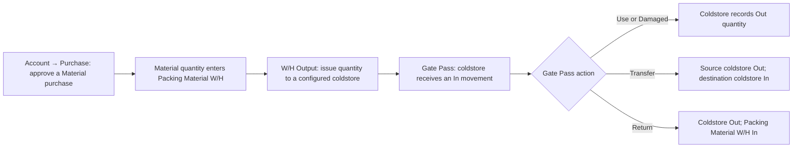
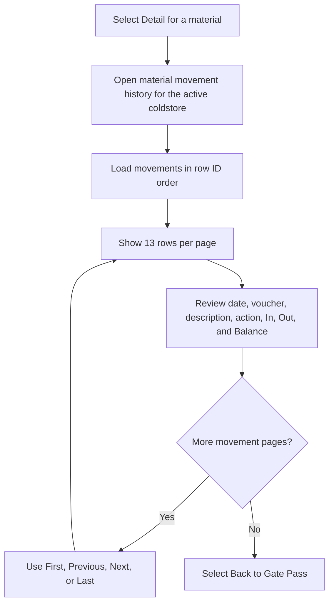

# Packing Material Gate Pass — User Flow

**Access:** The Packing Material sidebar shows **Packing Material Gate Pass** to users with the `material_gatepass` permission.

This screen manages packing material held at configured coldstores. It is separate from the main warehouse stock summary, but stock moves between them through the warehouse Output and Gate Pass Return actions.

## 1. Open a coldstore stock balance

## 2. Manage stock at a coldstore

## 3. Follow the connected stock movements

## 4. Inspect coldstore movements

## Rules and details

- Coldstore tabs are built from the locations already present in Gate Pass transactions. The active location determines which stock summary and movement detail are displayed.
- **Manage Stock** requires a date, material, voucher number, and quantity in the form. Description is optional. **Transfer To** is shown only for a Transfer action. There are no edit or delete controls for recorded movements.
- Every successful action records an **Out** movement for the active coldstore. **Transfer** also records an **In** movement for the selected destination. **Return** adds the quantity back to Packing Material W/H. **Use** and **Damaged** have no additional stock destination.
- Warehouse **Output** creates an In movement at the selected coldstore and an Out movement in Packing Material W/H. The Gate Pass and warehouse movement details are separate histories of the connected issue.
- Gate Pass stock movements do not create General Ledger entries in this flow.
- **Availability caveat:** the form's pre-submit check totals Gate Pass In and Out quantities for that material across all coldstores, rather than checking the active coldstore's balance. It also does not enforce a positive quantity or validate the submitted action and transfer destination server-side. A movement may therefore overdraw a particular coldstore or accept an invalid quantity/destination.
- **Feedback caveat:** the page displays a warning for insufficient quantity, but does not show a clear success/error result after a successful Manage action.
- **Balance caveat:** movement details start the running balance at zero on each page, so later pages do not include earlier-page movements in the displayed balance.
- The Purchase → Warehouse → coldstore stock path is documented in the [Packing Material W/H workflow](./packingMaterialWarehouseUserFlowDiagram.md).
