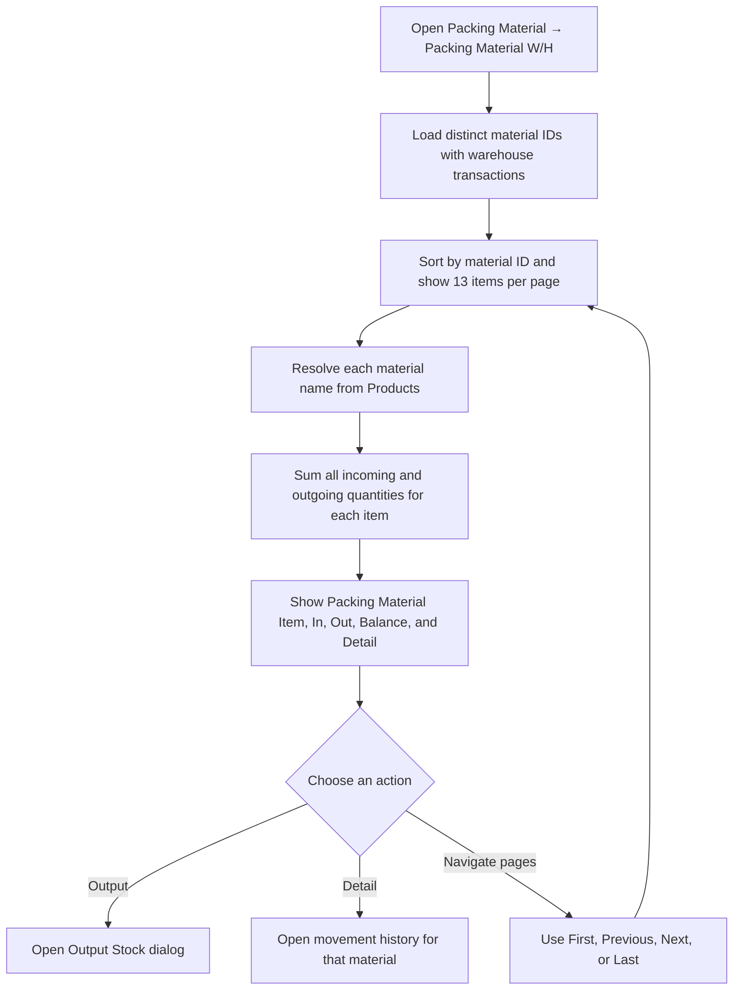
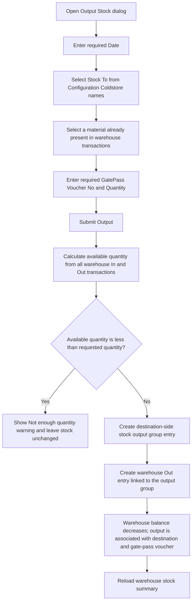
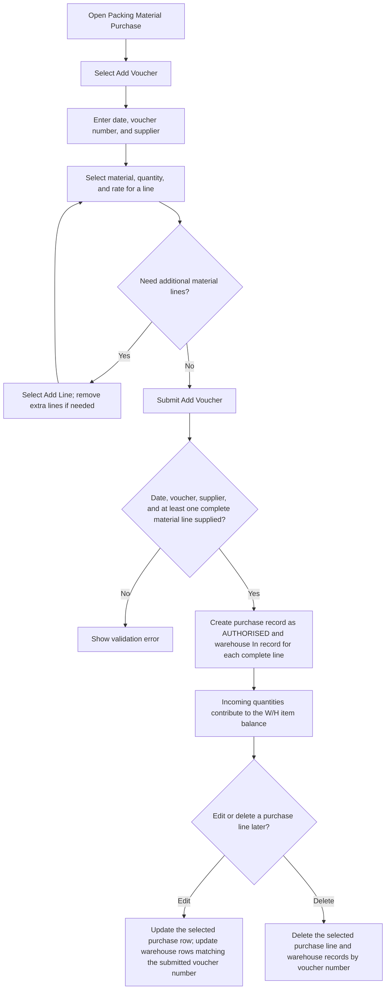
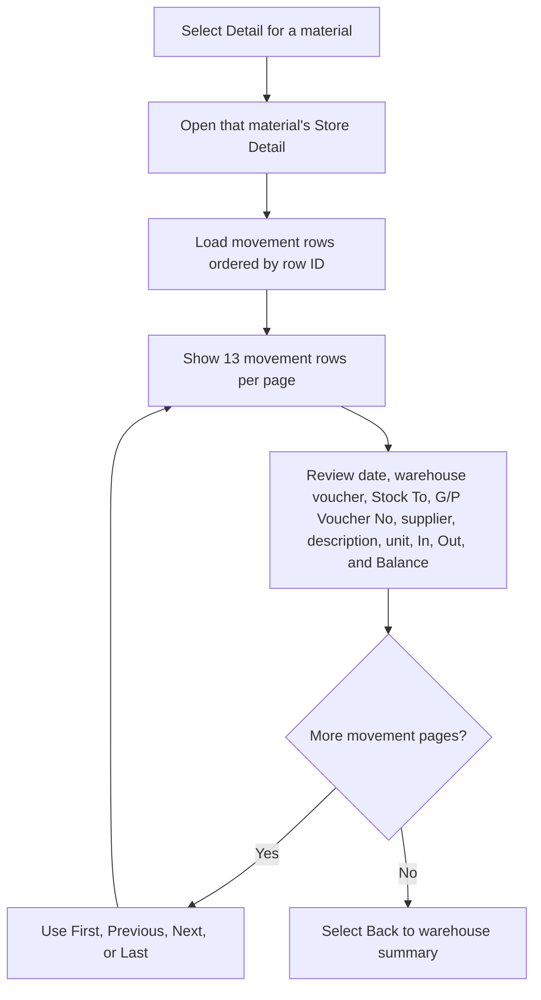

# Packing Material W/H — User Flow

This diagram documents warehouse stock summaries, issue-to-coldstore outputs, and item movement details.

## 1. Review packing material stock

## 2. Issue warehouse stock to a coldstore

## 3. Record incoming stock through Packing Material Purchase

## 4. Inspect material movements

## Rules and details

- The summary aggregates every warehouse transaction for each material: **In** is the sum of incoming quantities, **Out** is the sum of outgoing quantities, and **Balance** is In minus Out. Items with no warehouse transaction do not appear.
- Stock-in records are created through **Packing Material Purchase** (and other connected stock-return workflows); the Warehouse page itself exposes an **Output** action, not a direct stock-in form. A purchase voucher can contain multiple material lines; each complete line creates a purchase row and a warehouse In row. The purchase flow allows adding/removing lines, editing a purchase line, and deleting a purchase line.
- This dedicated **Packing Material Purchase** path creates a `purchases` record with status `AUTHORISED` as well as the warehouse stock-in. A/C Payable currently includes only `AWAITING_PAYMENT` and `PAID` purchases, so this AUTHORISED record is not included in its supplier balance or detail. This differs from an approved **Material** purchase created through the main **Account → Purchase** flow: it becomes `AWAITING_PAYMENT`, adds a warehouse stock-in, posts a debit to the line account and a credit to payable control account `2000`, and appears in A/C Payable.
- The Output dialog takes a date, a configured coldstore destination, a previously stocked material, a GatePass Voucher No, and a quantity. If the requested quantity is greater than current stock, the page warns **Not enough quantity** and does not call the output operation.
- A successful output creates both a stock-issue transaction in the warehouse and a destination-side stock output group record. The movement detail resolves the destination and gate-pass voucher from that linked record; incoming purchase entries display their supplier and warehouse voucher.
- Movement details show material unit from Products, supplier name when the supplier ID resolves to a contact, and description when present. The **Back** action returns to the warehouse list.
- **Validation caveat:** output quantity is not required to be positive on the server. A zero or negative quantity can pass the insufficient-stock check; a negative outgoing quantity can increase the calculated balance. Stock To and material are not marked required either.
- **Balance caveat:** the detail page paginates movement rows but initializes the running balance at zero on each page. A later page's displayed balance therefore omits movements from earlier pages.
- **Purchase-link caveat:** purchase-line edits update warehouse rows by voucher number rather than by the selected line. A multi-line voucher can therefore have multiple warehouse rows overwritten with the edited line's material and quantity; deleting one purchase line also deletes warehouse rows sharing that voucher. Changing the voucher number during an edit may leave the old warehouse row unmatched. See the root [TODO.md](../../TODO.md).
- **Follow-up issues:** enforce a positive output quantity and validate destination/material on the server; calculate detail balances across all prior movements rather than restarting on each page; synchronize purchase edits and deletions with only the matching warehouse line. See the root [TODO.md](../../TODO.md).
