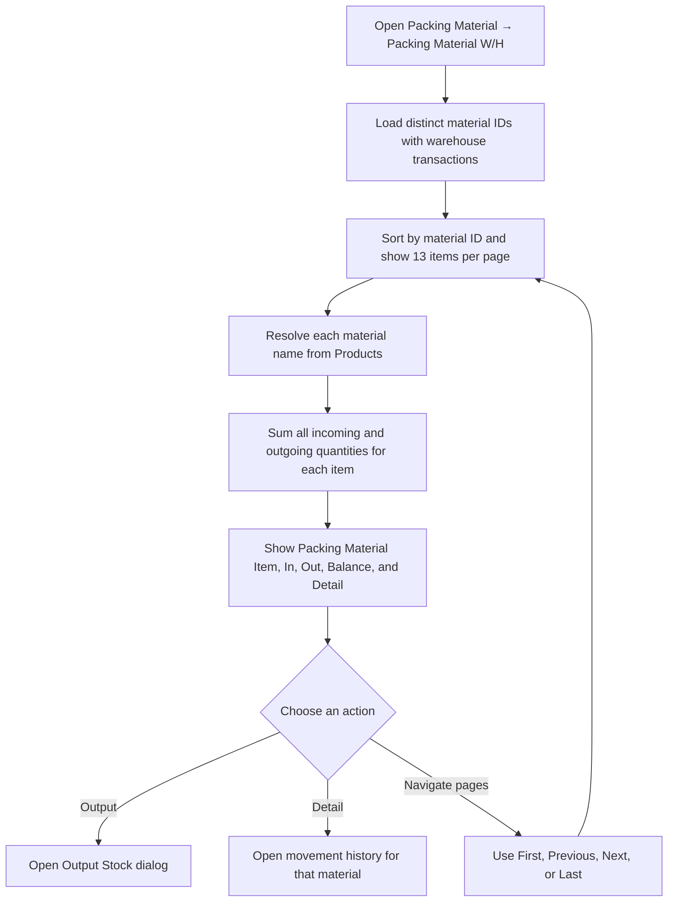
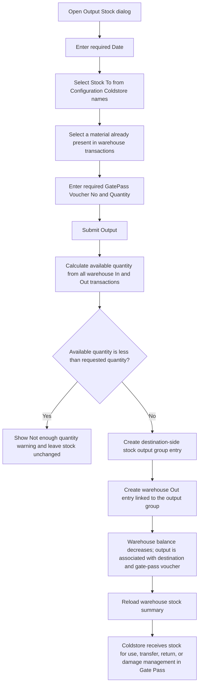
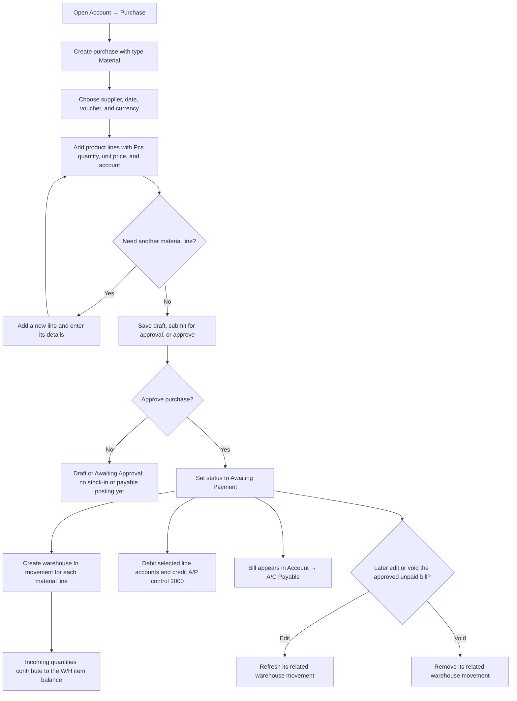
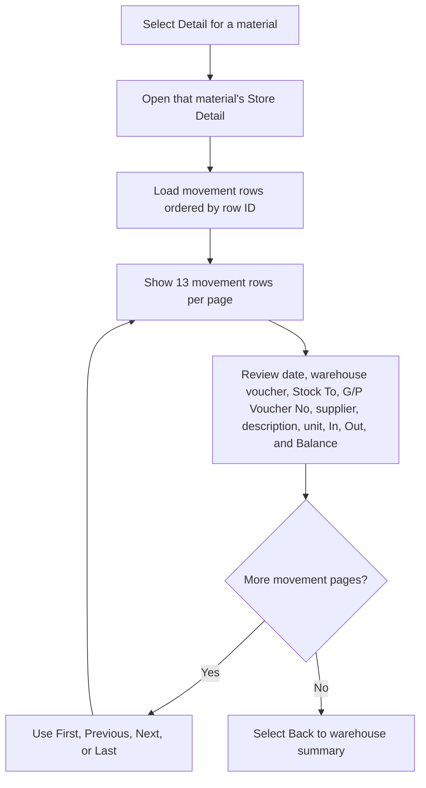

# Packing Material W/H — User Flow

This diagram documents warehouse stock summaries, issue-to-coldstore outputs, and item movement details. The coldstore-side Use, Transfer, Return, and Damaged actions are covered in the [Packing Material Gate Pass workflow](./packingMaterialGatePassUserFlowDiagram.md).

## 1. Review packing material stock

## 2. Issue warehouse stock to a coldstore

## 3. Record incoming stock through Account Purchase

## 4. Inspect material movements

## Rules and details

- The summary aggregates every warehouse transaction for each material: **In** is the sum of incoming quantities, **Out** is the sum of outgoing quantities, and **Balance** is In minus Out. Items with no warehouse transaction do not appear.
- The Packing Material workflow uses **Account → Purchase** with type **Material** for stock-in; the Warehouse page itself exposes an **Output** action, not a direct stock-in form. A Material purchase can contain multiple lines, and approval creates a warehouse In movement for each line. It also becomes an **Awaiting Payment** bill, posts its line-account debits and A/P control account `2000` credit to General Ledger, and appears in **Account → A/C Payable**. See the [Account Purchase workflow](../Account/purchaseUserFlowDiagram.md).
- The separate **Packing Material Purchase** screen is not part of this workflow.
- The Output dialog takes a date, a configured coldstore destination, a previously stocked material, a GatePass Voucher No, and a quantity. If the requested quantity is greater than current stock, the page warns **Not enough quantity** and does not call the output operation.
- A successful output creates both a stock-issue transaction in the warehouse and a destination-side stock output group record. The movement detail resolves the destination and gate-pass voucher from that linked record; incoming purchase entries display their supplier and warehouse voucher.
- Movement details show material unit from Products, supplier name when the supplier ID resolves to a contact, and description when present. The **Back** action returns to the warehouse list.
- Server-side output validation requires a positive quantity, a valid configured coldstore destination, a material present in warehouse stock, and sufficient available quantity. Invalid submissions show an error and do not create an output.
- Movement balances continue across pages, using transactions before the displayed page as the opening balance.
