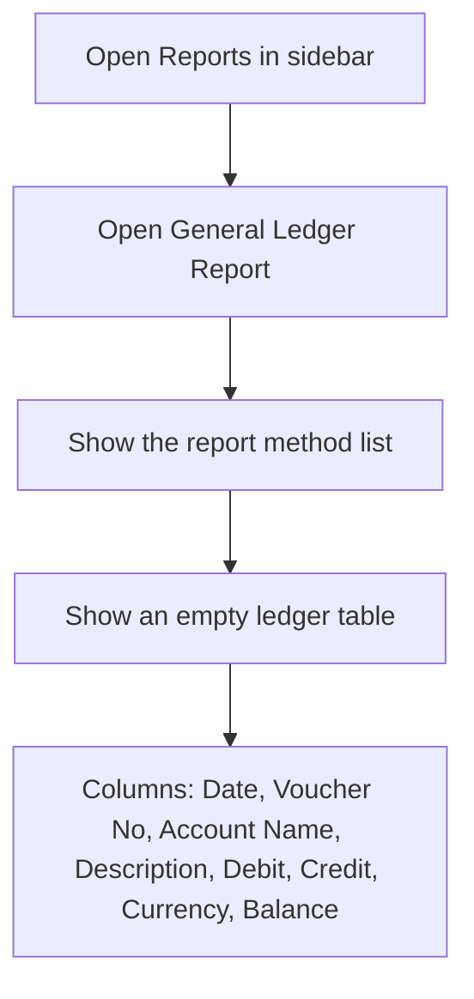
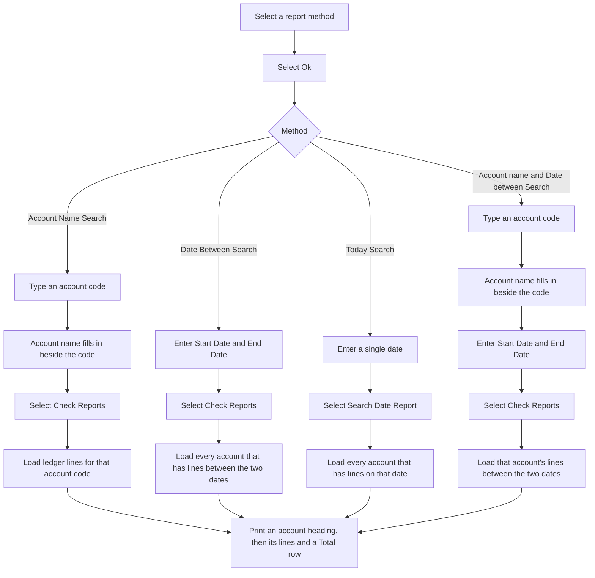
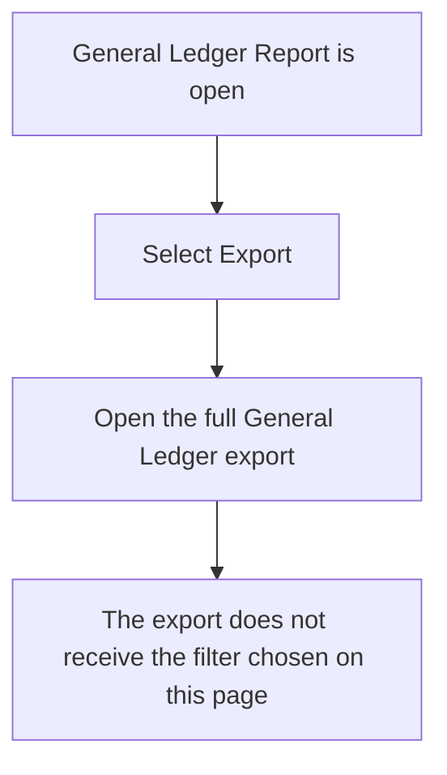

# General Ledger Report — User Flow

**Access:** The Reports sidebar shows General Ledger Report to roles with the `manage_generalledger` permission.

Until a search is run, the ledger table has headings only. Each successful search groups rows by account code, in date order, with a running balance of debit minus credit, then a total row for debit, credit, and balance. Currency is taken from the voucher.

## 1. Open the report

## 2. Choose a method and run the search

## 3. Export

