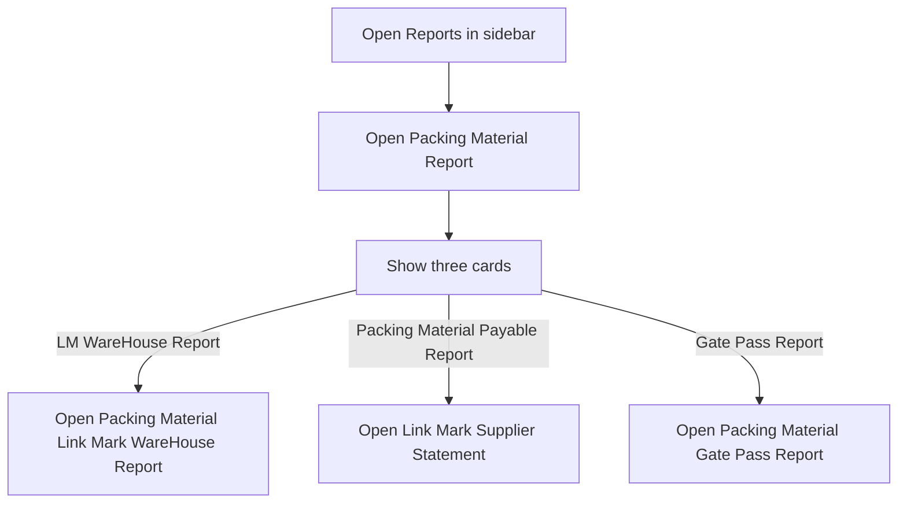
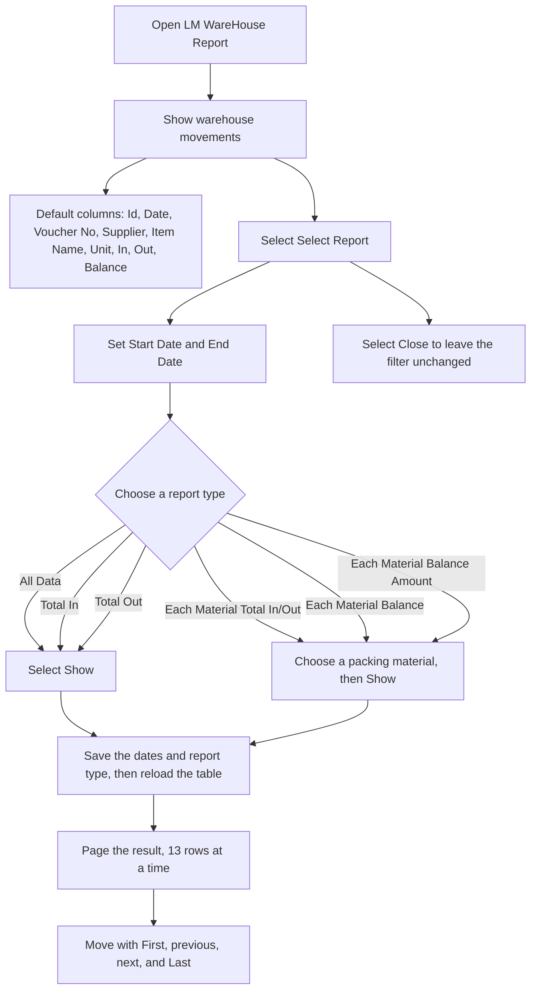
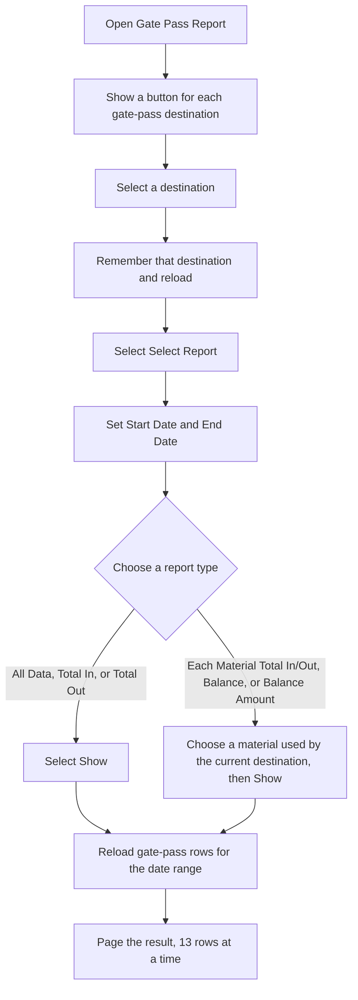
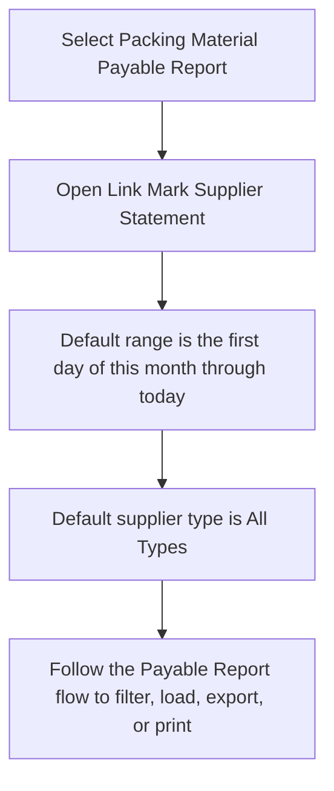

# Packing Material Report — User Flow

**Access:** The Reports sidebar shows Packing Material Report to roles with the `packing_material_report` permission.

The sidebar page is a hub with three cards. The payable card opens the same Supplier Statement used by Payable Report. The `type=material` value on that link is not applied, so the statement still defaults to All Types.

## 1. Choose a packing material report

## 2. Warehouse report

## 3. Gate Pass report

## 4. Packing Material Payable Report

