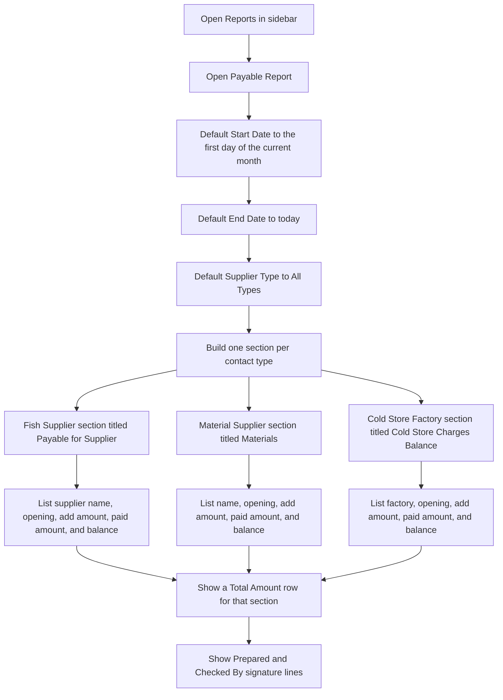
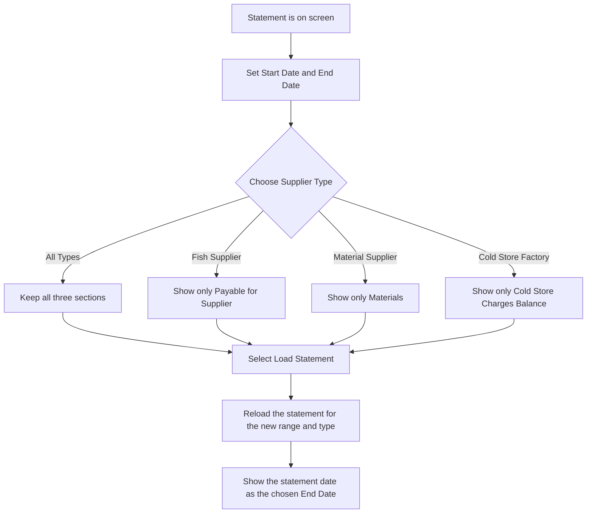
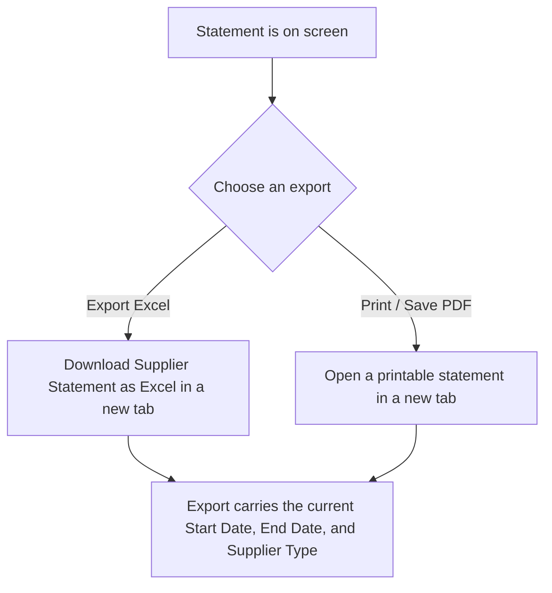

# Payable Report — User Flow

**Access:** The Reports sidebar shows Payable Report to roles with the `payable_report` permission.

The screen title is Link Mark Supplier Statement. It groups contacts by type and shows opening balance, additions, payments, and closing balance. Contacts with no opening, additions, payments, or balance in the range are omitted.

Opening balance is purchases before the start date, minus payments before the start date. Add Amt is purchases inside the range. Paid Amt is payments inside the range. Balance is opening plus additions minus payments. Only purchases with status Awaiting Payment or Paid are counted.

## 1. Open the statement

## 2. Change the date range or supplier type

## 3. Export or print

