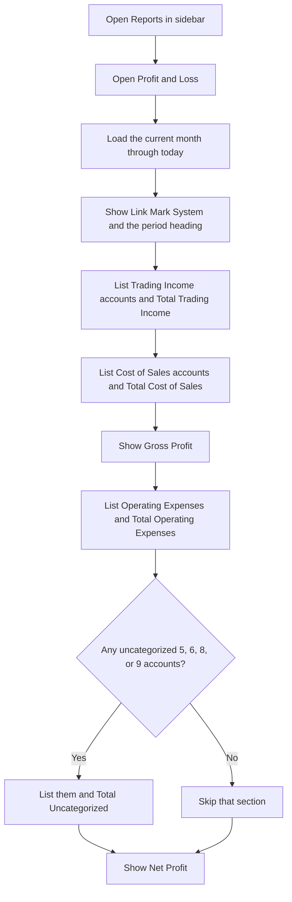
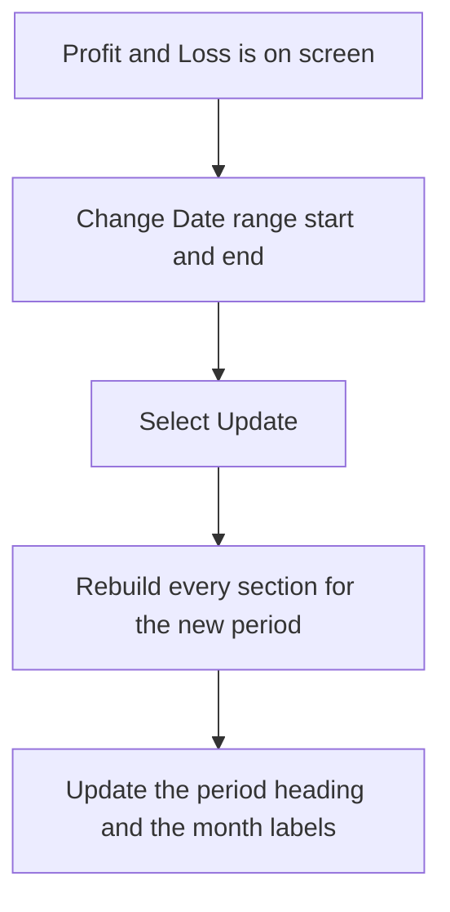
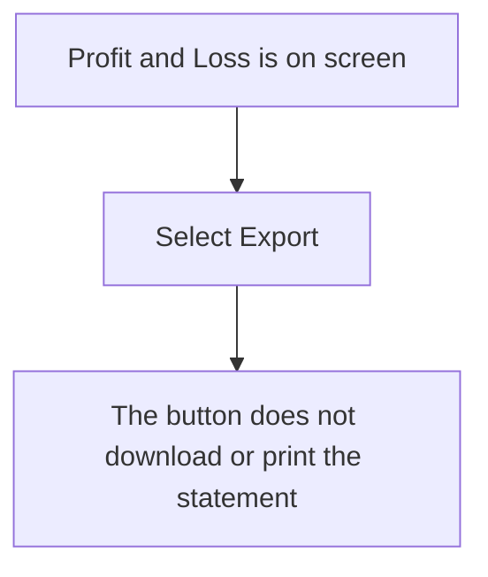

# Profit and Loss — User Flow

**Access:** The Reports sidebar shows Profit and Loss to roles with the `profit_loss_report` permission.

The statement covers the chosen date range. On first open, the range is the first day of the current month through today. Income is credit minus debit. Cost of sales and expenses are debit minus credit. Gross Profit is trading income minus cost of sales. Net Profit is gross profit minus operating expenses and any uncategorized expense lines. A negative net profit is shown in parentheses.

Accounts are placed by chart-of-accounts class and type:

- Trading Income: Revenue, Income, or Sales
- Cost of Sales: Direct Costs, Cost of Sales, COGS, or Purchase
- Operating Expenses: Expense, Operating, or Overhead
- Uncategorized: remaining ledger movement on account codes starting with 5, 6, 8, or 9

Asset, liability, and payable codes are left out of the statement. A section with no movement shows an empty message for that section. The Uncategorized section appears only when such accounts have movement.

## 1. Open the statement

## 2. Change the period

## 3. Export control

