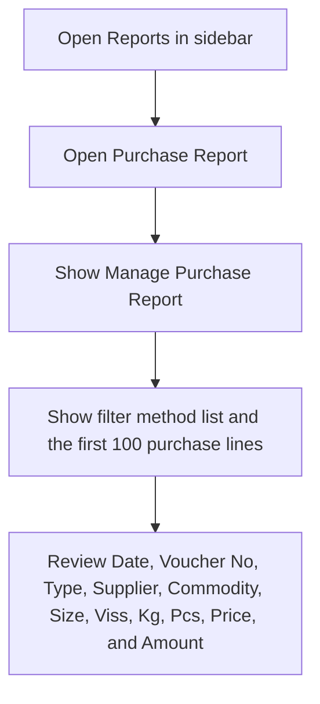
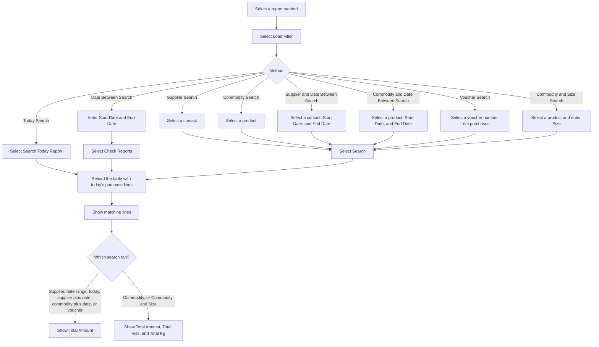
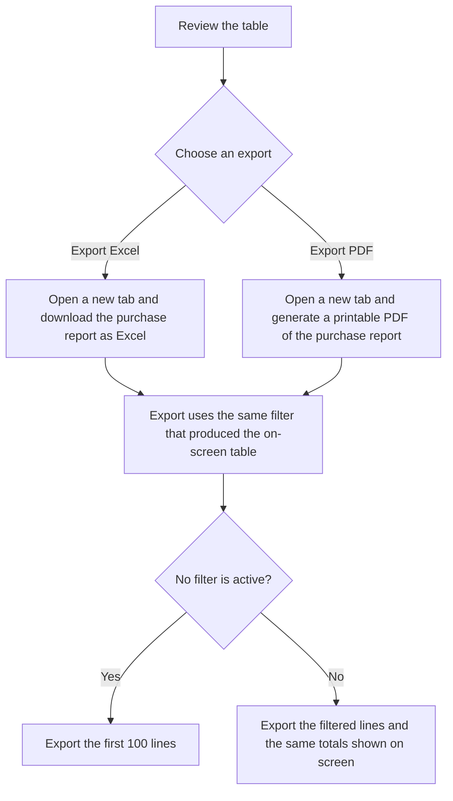

# Purchase Report — User Flow

**Access:** The Reports sidebar shows Purchase Report to roles with the `purchase_report` permission.

The page lists purchase lines from approved and other purchase bills. Kg is displayed as Viss × 1.634. With no filter applied, the table shows the first 100 lines and no footer totals.

## 1. Open the report

## 2. Choose a filter and load the matching lines

## 3. Export the current result

