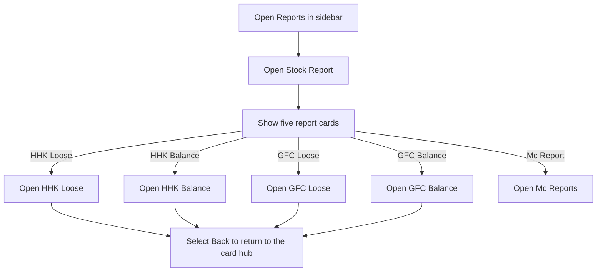
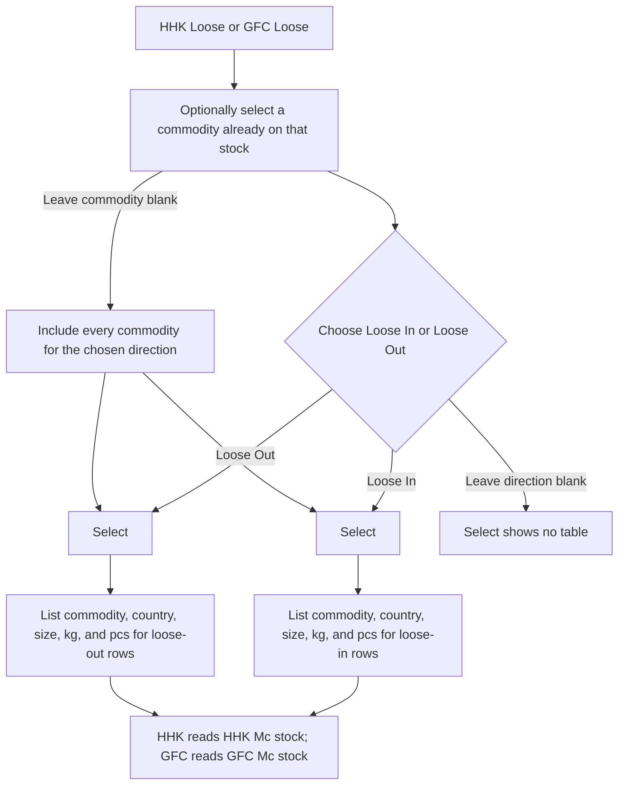
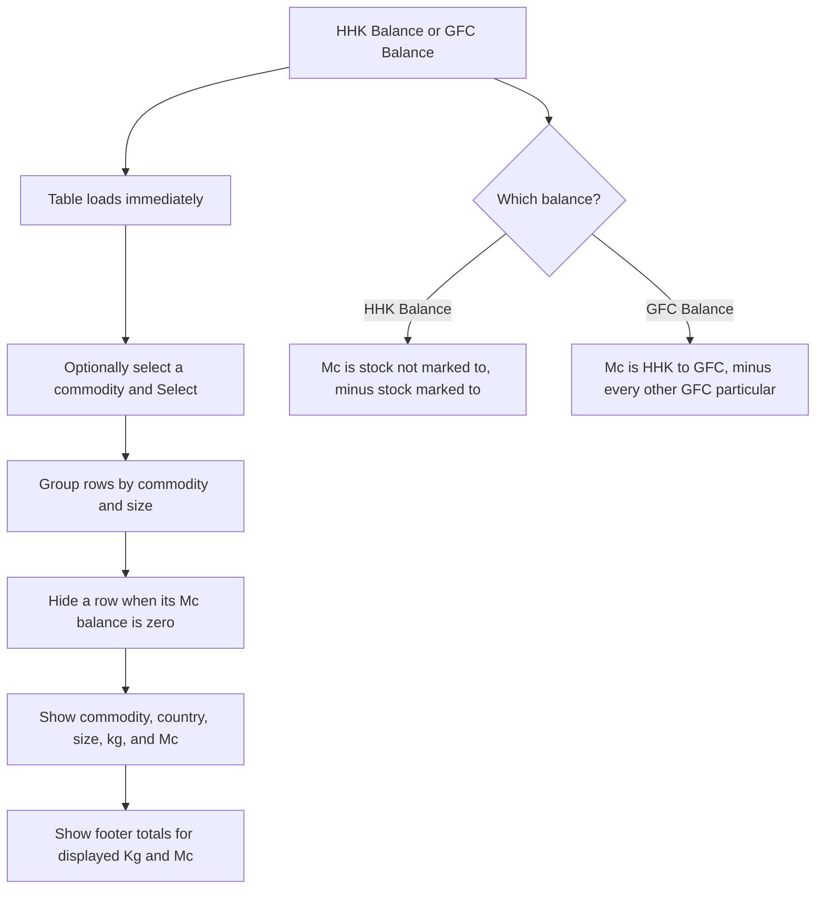
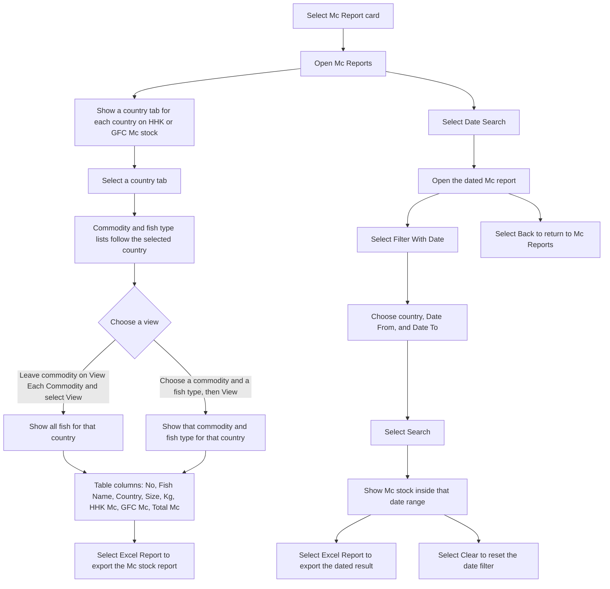

# Stock Report — User Flow

**Access:** The Reports sidebar shows Stock Report to roles with the `manage_stockreport` permission.

The page is a hub. Each card opens a report on the same page, except Mc Report, which opens the Mc Reports screen.

## 1. Choose a stock report

## 2. HHK Loose or GFC Loose

## 3. HHK Balance or GFC Balance

## 4. Mc Report

