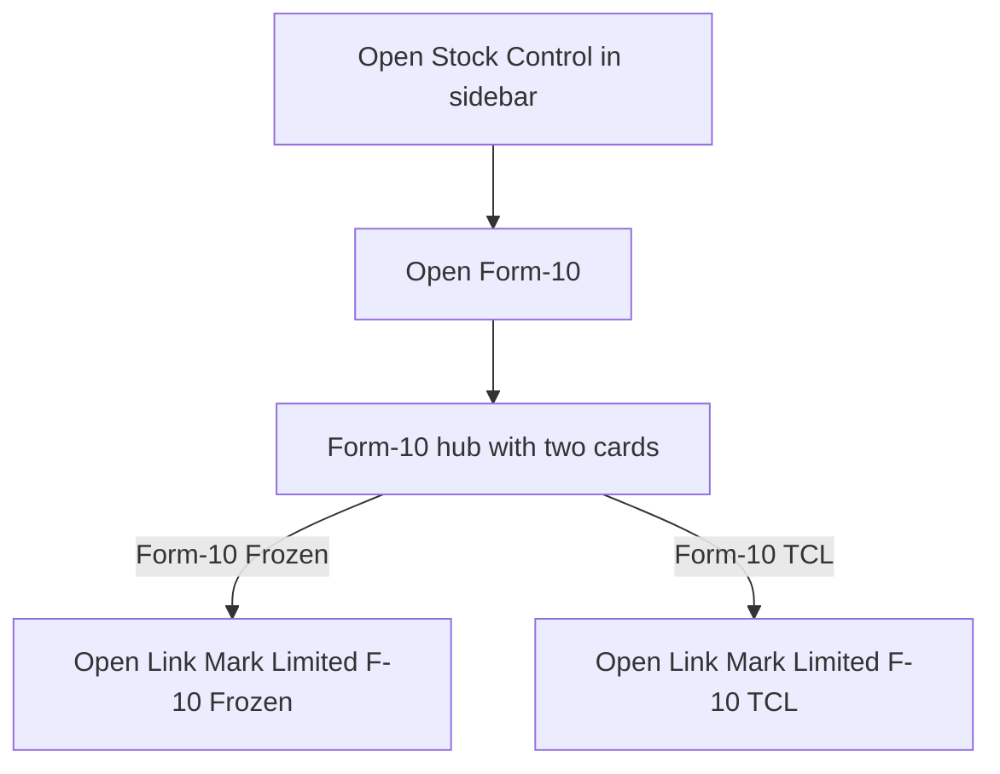
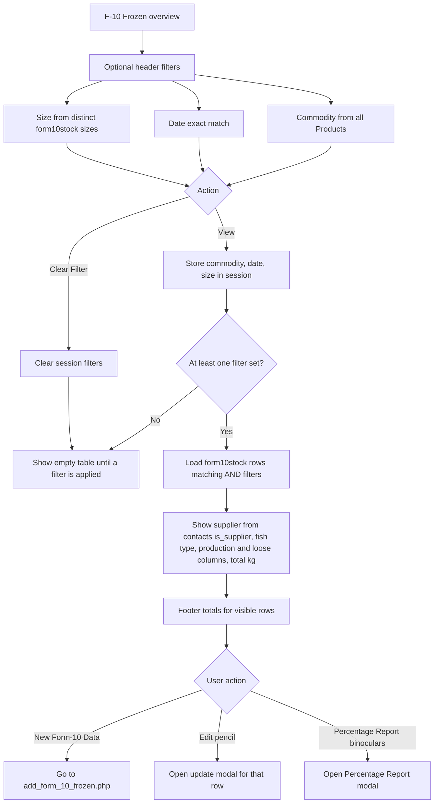
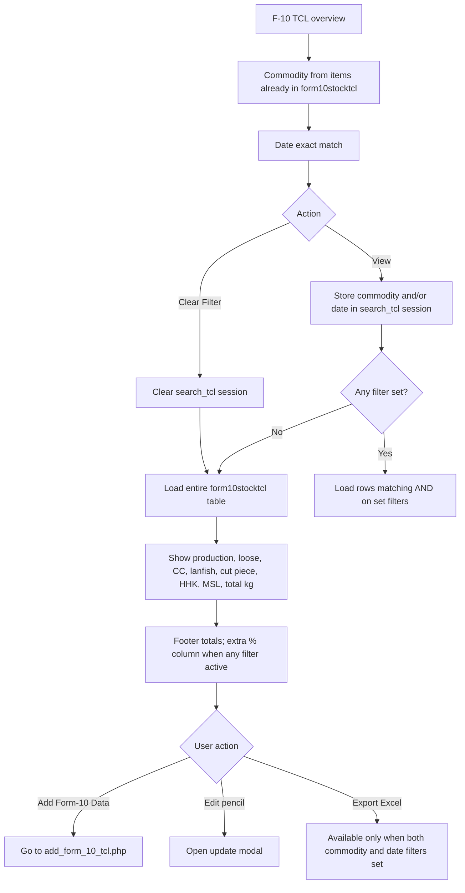
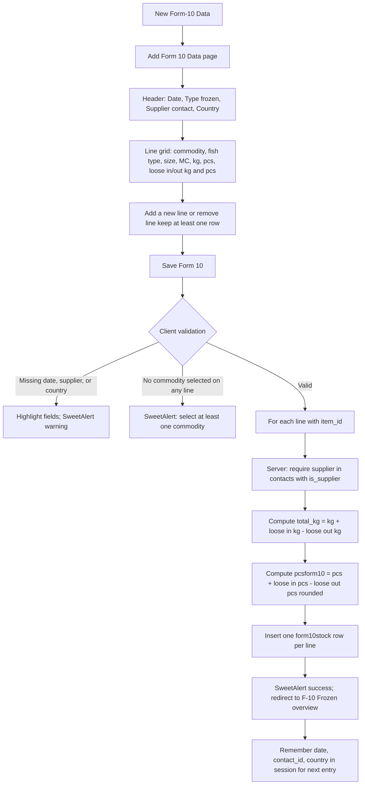
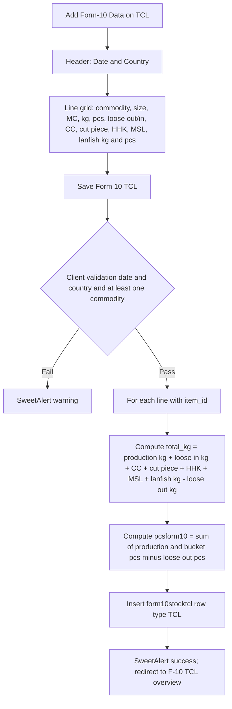
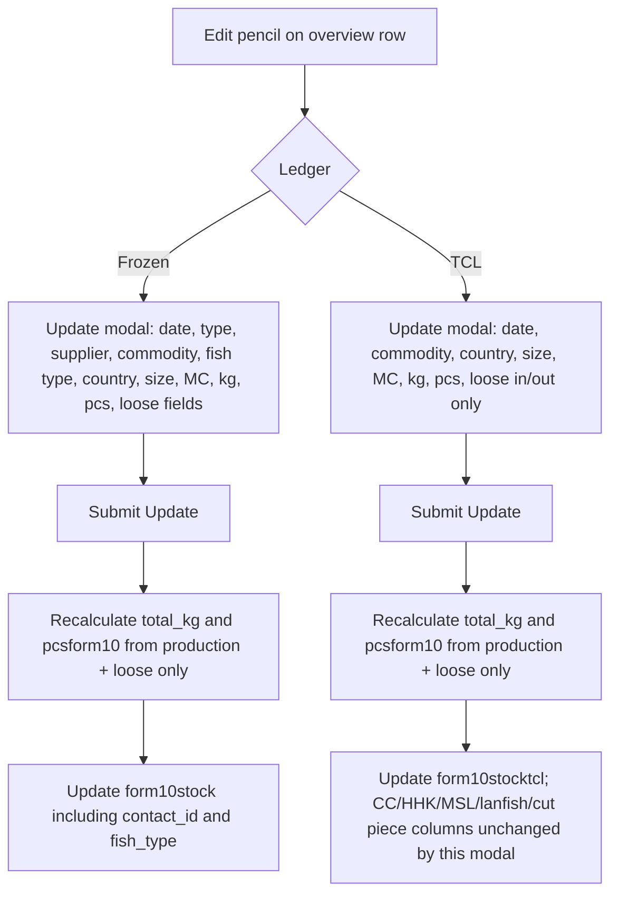
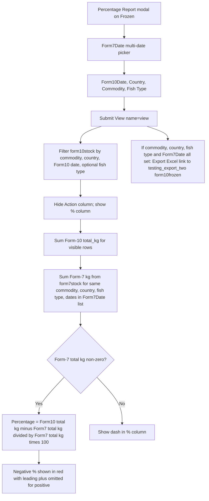
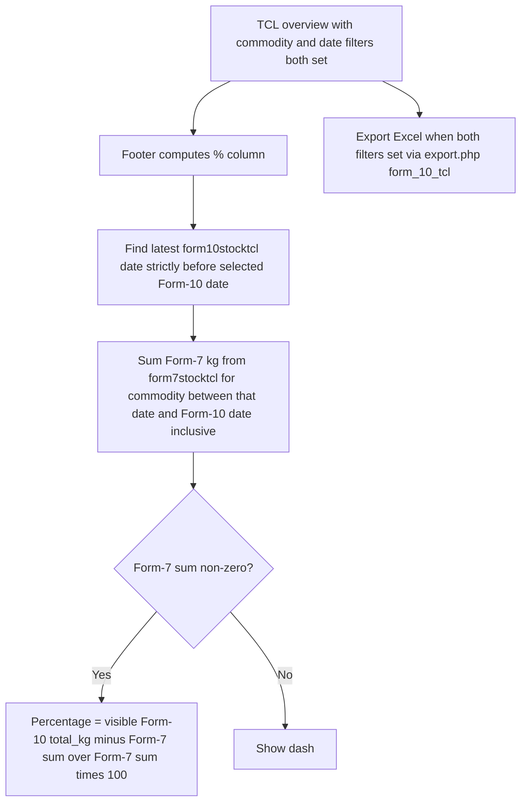

# Form-10 — User Flow

**Access:** The **Stock Control** sidebar shows **Form-10** to roles with the `manage_form10` permission.

Form-10 records **production output** after Form-7 intake: MC, kg, pcs, loose movements, and (for TCL) split balances (CC, လမ်းငါး, Cut Piece, HHK, MSL). Data lives in **Frozen** (`form10stock`) and **TCL** (`form10stocktcl`). Entries are created on dedicated **Add Form-10** screens; the overview pages filter, edit, compare totals to Form-7, and export. See the [Form-7 workflow](./form7UserFlowDiagram.md) for raw intake and the [Purchase workflow](../Account/purchaseUserFlowDiagram.md) where Form-7 rows often originate.

## 1. Open Form-10 and choose a ledger

## 2. Review Frozen production rows

## 3. Review TCL production rows

## 4. Add Frozen Form-10 (multi-line)

## 5. Add TCL Form-10 (multi-line)

## 6. Update an existing row

## 7. Percentage report vs Form-7 (Frozen)

## 8. Percentage vs Form-7 (TCL)

## Rules and details

- **Two ledgers:** **Form-10 (Frozen)** uses `form10stock` with supplier (`contact_id`), **fish_type**, and type frozen/tcl on each row. **Form-10 (TCL)** uses `form10stocktcl` with extra bucket columns (CC, lanfish, cut piece, HHK, MSL) and fixed type **TCL** on insert.
- **Permissions:** `manage_form10` gates the menu; Frozen and TCL share one permission.
- **Frozen list behaviour:** The main table stays **empty until at least one** of commodity, date, or size filter is applied and **View** is clicked. **TCL list behaviour:** With **no** filters, **View** loads **all** TCL Form-10 rows; with one or both filters, rows must match every set filter.
- **Calculated fields on save:** **PCS/Form-10** (`pcsform10`) and **Total kg** (`total_kg`) are computed server-side on add (and on update for the fields included in the update handler). Frozen: totals use production plus loose in minus loose out. TCL add: totals include all bucket kg/pcs; TCL **update** only recomputes from production and loose columns—bucket fields are not editable in the update modal.
- **Supplier (Frozen):** Add and update require a **contacts** record with `is_supplier = 1`. Invalid supplier throws a validation error on save.
- **No delete:** Neither overview exposes row delete; corrections are done via **Update** only.
- **Session helpers:** After a successful Frozen add, date, supplier, and country are stored in session for the next entry. TCL add stores date and country.
- **Percentage reports** compare aggregated **total kg** on the filtered Form-10 view to Form-7 intake (Frozen: explicit multi-date Form-7 selection plus country and fish type; TCL: Form-7 TCL kg over a date window anchored on the prior Form-10 date). They are operational variance indicators, not accounting postings.
- **Exports:** Frozen percentage view can export via **testing_export_two.php** when modal criteria are complete. TCL exports via **export.php** when both commodity and date header filters are set.
- **Downstream use:** Form-10 totals appear in **stock/Mc reports**, **export** layouts, and related packing-cost screens (e.g. material per kg uses a separate `form10kg` input on truck packing material). **TCL Mc Stock** is a separate screen that records MC movements including a **Form-10 MC** column; it is not auto-created when saving Form-10 TCL lines.
