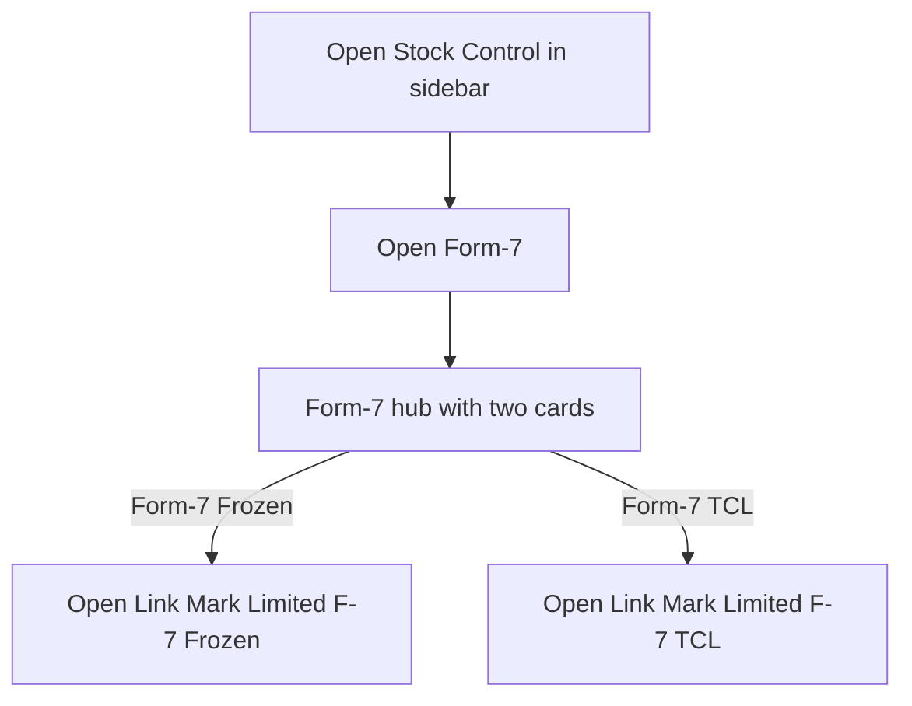
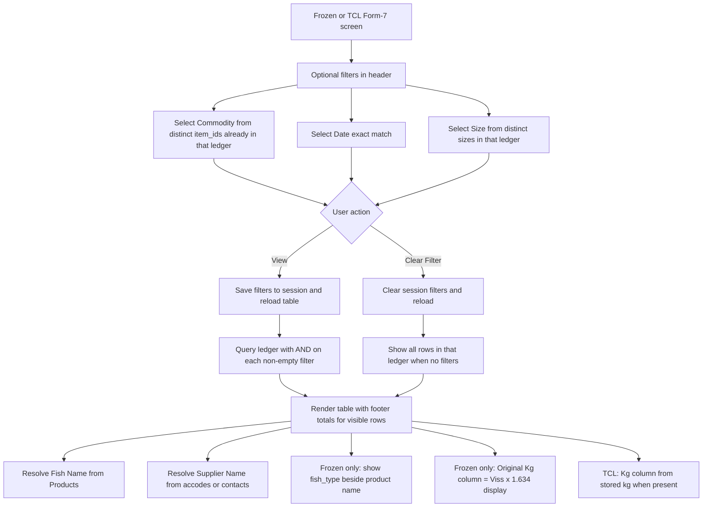
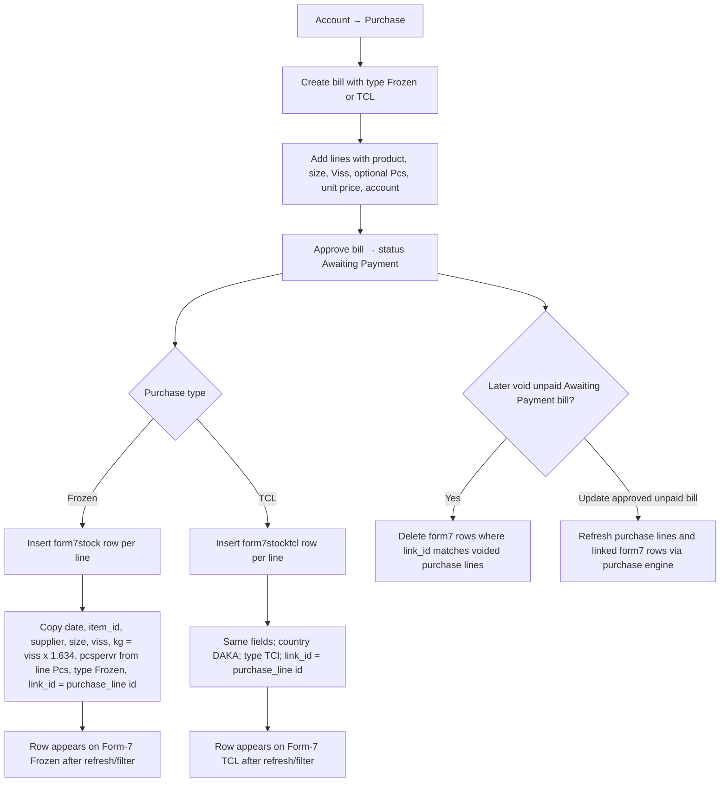
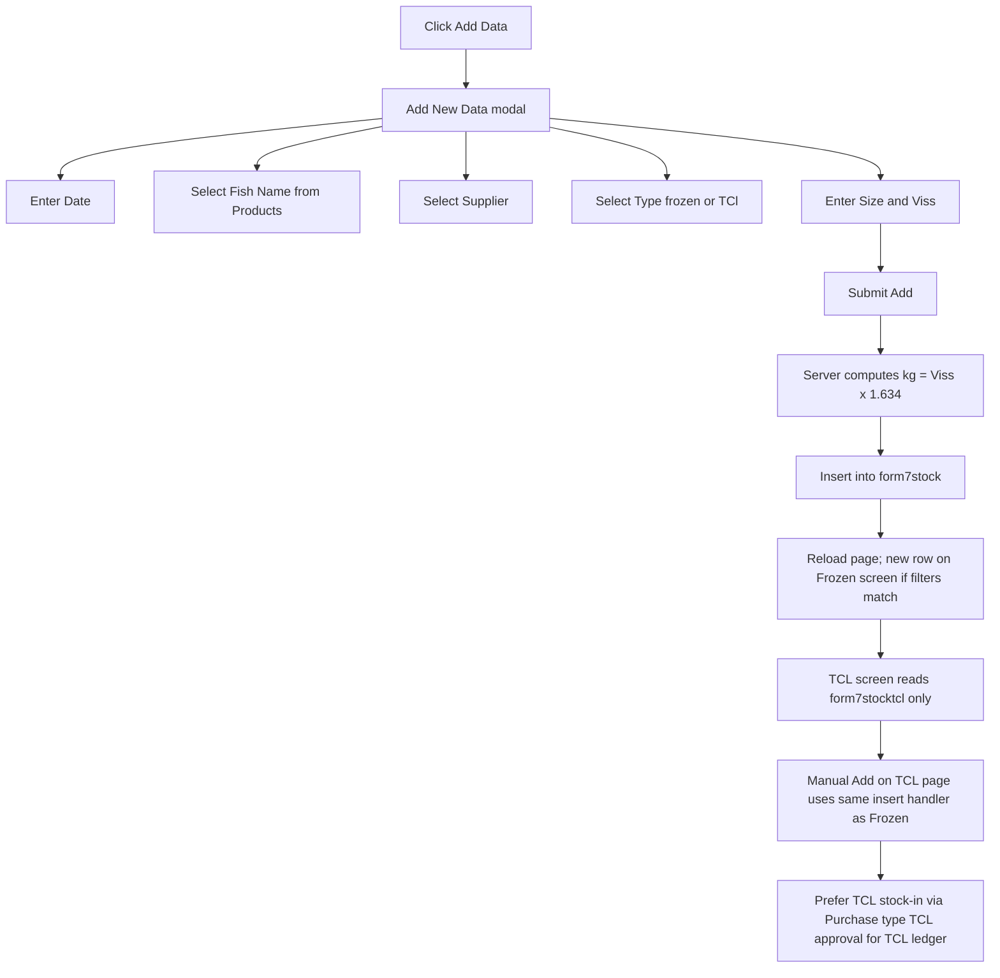
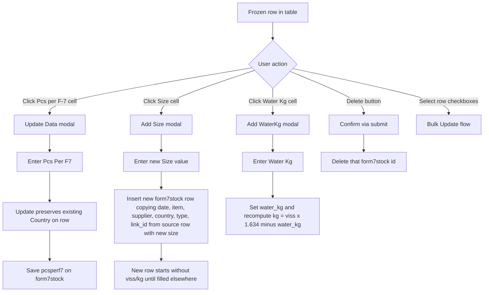
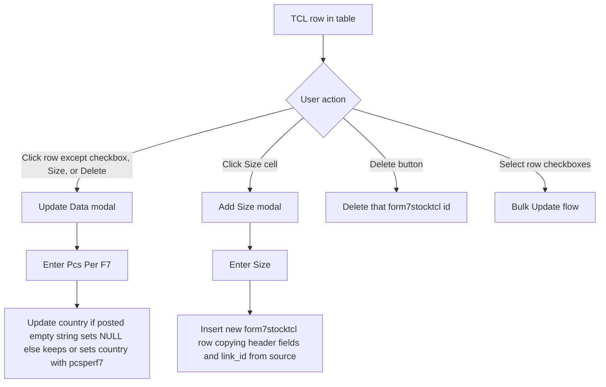
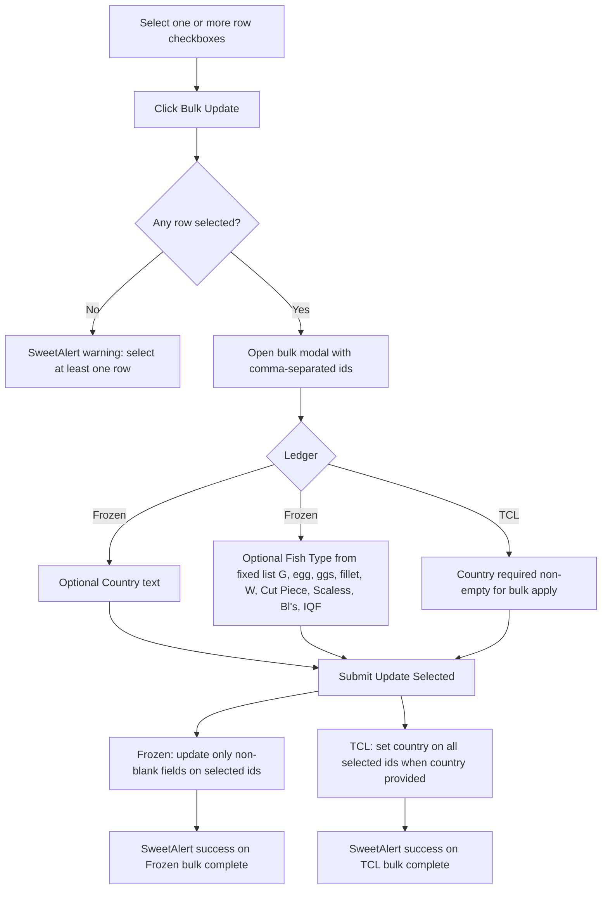

# Form-7 — User Flow

**Access:** The **Stock Control** sidebar shows **Form-7** to roles with the `manage_form7` permission.

Form-7 records incoming fish stock (by commodity, supplier, size, and weight) in two parallel ledgers: **Frozen** (`form7stock`) and **TCL** (`form7stocktcl`). Most rows are created when an **Account → Purchase** bill of type **Frozen** or **TCL** is approved; both screens also support manual entry, filters, line maintenance, and bulk updates. See the [Purchase workflow](../Account/purchaseUserFlowDiagram.md) for bill approval and void behaviour.

## 1. Open Form-7 and choose a ledger

## 2. Filter and review rows

## 3. Stock-in from Account Purchase (primary path)

## 4. Manually add a Form-7 row

## 5. Maintain a row (Frozen)

## 6. Maintain a row (TCL)

## 7. Bulk update selected rows

## Rules and details

- **Two ledgers:** **Form-7 (Frozen)** lists `form7stock`. **Form-7 (TCL)** lists `form7stocktcl`. They share the same sidebar entry (`form_7.php`) but different detail pages (`form_7_frozen.php`, `form_7_tcl.php`).
- **Permissions:** `manage_form7` gates the menu item; there is no separate Frozen vs TCL permission.
- **Filters** (commodity, date, size) are stored in `$_SESSION['search']` and combined with **AND**. **View** applies them; **Clear Filter** empties them. With no filters, the full ledger loads. Filter dropdowns only list values that already exist in that ledger’s table.
- **Columns (Frozen):** Date, Fish Name (with `fish_type` in parentheses when set), Supplier, Type, Country, Size, Viss, **Original Kg** (display-only Viss × 1.634), **Water Kg**, **Kg** (stored; adjusted when water is applied), Pcs per Vr, Pcs per F-7, Delete.
- **Columns (TCL):** Same except no Water Kg / Original Kg columns; **Kg** is shown from the stored value when present.
- **Footer totals** sum Viss, Kg (Frozen stored kg total), Pcs per Vr, and Pcs per F-7 for **currently visible** filtered rows only.
- **Purchase link:** Approved Frozen/TCL purchase lines create Form-7 rows with `link_id` pointing at `purchase_lines.id`. Voiding an unpaid **Awaiting Payment** purchase removes linked Form-7 rows in the matching ledger. Updating an approved unpaid purchase refreshes stock through the purchase engine.
- **Manual add:** Computes **kg = Viss × 1.634** and inserts into **`form7stock`** only. Rows on the TCL screen normally come from **Purchase type TCL** approval into **`form7stocktcl`**. The TCL **Add Data** button calls the same insert as Frozen; use purchase approval for TCL ledger entries unless manual Frozen-table entry is intentional.
- **Add Size** does not edit the current row in place; it **inserts a sibling row** with the same date, commodity, supplier, country, type, and `link_id`, and the size you enter (quantities on the new row are empty until entered or supplied by purchase).
- **Frozen Pcs per F-7 update** changes only `pcsperf7` and leaves **Country** unchanged from the existing row.
- **Water Kg (Frozen only):** Updates `water_kg` and sets **Kg** to `(Viss × 1.634) − water_kg`.
- **Bulk update (Frozen):** Blank Country or Fish Type means “no change” for that field. **Bulk update (TCL):** Requires a non-empty **Country**; otherwise the handler returns without updating.
- **Delete** removes a single row by id from the active ledger; there is no undo on the Form-7 screens.
- **Supplier pickers:** Frozen **Add Data** lists suppliers from `accodes` (code) union `contacts` (id). TCL **Add Data** lists `contacts` (id and name). Display rows resolve suppliers via `accodes.code` or `contacts.id` as stored on the row.
- Form-7 quantities feed **Mc stock reports**, **packing/stock exports**, and downstream **Form-10** workflows; those screens are documented separately under Stock Control.
