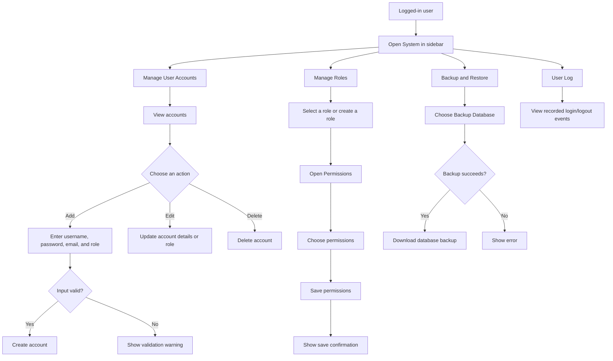

# System User Flow Diagram

```mermaid
flowchart TD
A[Logged-in user] --> B[Open System in sidebar]

    B --> C[Manage User Accounts]
    C --> C1[View accounts]
    C1 --> C2{Choose an action}
    C2 -->|Add| C3[Enter username, password, email, and role]
    C3 --> C4{Input valid?}
    C4 -->|Yes| C5[Create account]
    C4 -->|No| C6[Show validation warning]
    C2 -->|Edit| C7[Update account details or role]
    C2 -->|Delete| C8[Delete account]

    B --> D[Manage Roles]
    D --> D1[Select a role or create a role]
    D1 --> D2[Open Permissions]
    D2 --> D3[Choose permissions]
    D3 --> D4[Save permissions]
    D4 --> D5[Show save confirmation]

    B --> E[Backup and Restore]
    E --> E1[Choose Backup Database]
    E1 --> E2{Backup succeeds?}
    E2 -->|Yes| E3[Download database backup]
    E2 -->|No| E4[Show error]

    B --> F[User Log]
    F --> F1[View recorded login/logout events]
```
